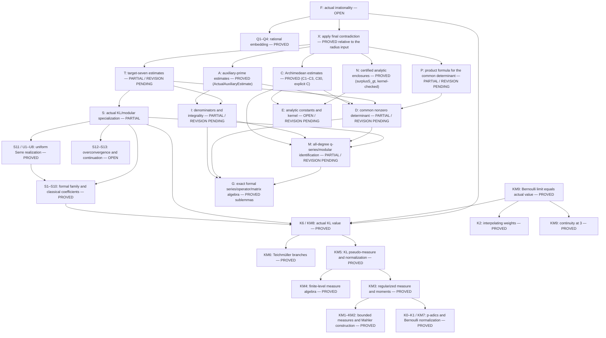

> **HISTORICAL RECORD** (written before 19 September 2026). The ζ₇(3) irrationality theorem is now proved in Lean with a fully internal proof whose endpoints depend only on `propext`, `Classical.choice` and `Quot.sound`; see `README.md` and `FULLY_INTERNAL_COMPLETION.md` at the repository root. Status statements below are historical and have not been rewritten.

# Master ledger: unconditional irrationality of the actual ζ₇(3)

Status: PROVED RELATIVE TO THE RETAINED PUBLISHED RADIUS INPUT. The intended theorem
`¬ IsRationalSeven zeta7Three` compiles as `Zeta7Main.zeta7Three_irrational`; its transitive axioms
are `propext`, `Classical.choice`, `Quot.sound` and `Zeta7Main.published_radius49_geometric_continuation`.
The genuine value is constructed in
[Zeta7Proof/KubotaLeopoldt.lean](Zeta7Proof/KubotaLeopoldt.lean).
`Zeta7Main.zeta7Three` is branch 4 of the constructed Kubota–Leopoldt
function evaluated at 3. Internalizing the radius input is the remaining task.

## Current authorization: retain the published radius input (15 September 2026)

The user's latest instruction retains the existing, unchanged
`Zeta7Main.published_radius49_geometric_continuation` and its published-input
dependency. Its internal formalization is deferred. The statement of the
axiom and the proof of `HSeries_radius49` are preserved exactly. No other
external mathematical assumption is authorized. The final axiom audit must
display this dependency explicitly; a completed result would be described
as **formalized relative to the retained published radius input**.

## Final theorem relative to the published radius input (18 September 2026)

Current correspondence: [FINAL_RELATIVE_RADIUS_CHECKPOINT.md](FINAL_RELATIVE_RADIUS_CHECKPOINT.md).

**Endpoints.**

- `Zeta7Main.zeta7Three_irrational : ¬ Zeta7Partial.IsRationalSeven Zeta7Main.zeta7Three`
- `Zeta7Main.eta_irrational : ¬ Zeta7Partial.IsRationalSeven Zeta7Main.eta`. The rational value `0` is
  included, and `eta ≠ 0` is never assumed.

The transitive axioms of both are `propext`, `Classical.choice`, `Quot.sound` and
`Zeta7Main.published_radius49_geometric_continuation`. The only nonfoundational dependency is the
retained radius input. It enters through the target-seven estimate A and is unchanged.

**New modules** (all of C and the numerics use the three foundational axioms only):

| Area | Modules | What they prove |
|---|---|---|
| C4 / C30 | `ArchC30` | Gram positivity (`gram_norm_pos`, `gram_det_re_pos`); one adapted basis satisfying (41) on all six circles; the Lipschitz function `φ(k) = min_i(W_i - k t_i)`; the Riemann-sum bound and limit; (46); `c30`. |
| Explicit C | `ArchCTheorem` | `J` and the bounds `b_i`; `∫₀⁷ φ ≤ J`; the C theorem `c_theorem`. |
| N | `CertArctan`, `CertEnergyDefs`, `CertEnergyTerms`, `CertEnergyPairs`, `CertSurplus` | The explicit energy (48), with exact cutoffs; 38 generated term certificates; `surplusS_gt : 223/6250 < 43 log 7 + (7/2) I - J - 12325/168`. The certificates use Machin/Mathlib `π` bounds, the `log 2` bound and the alternating `log(8/7)` series, arctangent half-angle reductions and alternating Taylor bounds. |
| Modular zero count | `ValenceWeierstrass`, `LevelSevenE6Quotient`, `LevelSevenFunctionIdentities`, `ValenceLattice`, `ValenceGeneric` | See "Modular zero count" below. |
| Averaged Jensen | `ValenceQDisc`, `ValenceCosets`, `ValenceJensen`, `ValenceIntegral`, `EnergyCircle`, `EnergyOrbit`, `EnergyUpper` | See "Averaged Jensen" below. |
| Assembly | `FinalConditional`, `FinalTheorem`, `FinalAudit` | The contradiction, from N, A (`δ = 1/1000`), P (`ε = 1/200`), C (`ε = 1/200`), the exact product formula, `S > 223/6250` and `log 7 < 2`. |

**Modular zero count.**

- Equal `g₂, g₃` give equal `℘` and equal lattices (`lattice_eq_of_g`, via a Taylor recurrence from
  `℘'' = 6℘² - g₂/2`).
- `E₆ P(x)² = A³ T(x)` is proved with a weight-18 Sturm bound, and `E₄, E₆` quotient identities hold on `ℍ`.
- `G_k(ℤτ+ℤ) = 2ζ(k)E_k(τ)`.
- `x(τ₁) = x(τ₂)` gives an `SL(2,ℤ)` relation.
- `x(-1/z) = 1/(49 x(z/7))`, so the non-identity cosets are excluded almost everywhere
  (`generic_fiber`).

**Averaged Jensen.**

- `xFun(e^{2πiτ}) = x(τ)`.
- Möbius chain rules give simple zeros.
- Normalised lower rows `(c, d)` parametrise the zeros.
- The pointwise Jensen bound is `jensen_bound`.
- The real integral `∫(y/(v²+c²y²) - t)₊ = (2/c)(arccos a - a√(1-a²))` is evaluated.
- At most `φ(c)` of `c` consecutive integers are prime to `c`.
- Averaging over the circle gives `energyW_le`, and finally `energyI_le_explicitI : I ≤ Σ w_i w_j E(y_i, y_j)`.

**Scope.** The explicit formula (48) is proved as the upper bound `∫U_j dμ_i ≤ E(y_i, y_j)`, which is
exactly what C needs. The equality (the lower bound) is not formalized.

**Verification.**

- The exhaustive audit `FinalAudit` covers 579 declarations. Only `FinalConditional` and `FinalTheorem`
  use the radius input.
- The C1/C2 audit (310 declarations) and the C3 audit (137 declarations) pass unchanged.
- The module build passed with 9096 jobs, and the full `lake build` with 9125 jobs.
- The root and this ledger have exact `FINAL_*.before` backups.

**Next.** Internalize `Zeta7Main.published_radius49_geometric_continuation` in new modules (R1–R4)
without editing it until an internal replacement compiles.

## C3 complete: energy inequality (43) and Gram limsup (45) (18 September 2026)

Current correspondence: [ARCH_C3_CHECKPOINT.md](ARCH_C3_CHECKPOINT.md).
This entry supersedes the previous entry's first unproved C statement, which was (43). The
following are preserved and audited:

- P (`Zeta7Auxiliary.actualAuxiliaryEstimate`);
- `Zeta7Cert.log_seven_lt_two`;
- all C1/C2 endpoints.

C does not use `published_radius49_geometric_continuation`. The determinant, source basis,
germs, jump rows and pins are unchanged.

**New modules:** `ArchGaussPD`, `ArchRegLog`, `ArchRegKernel`, `ArchEnergyIneq`,
`ArchC3Endpoint`. The audit is in `ArchC3Audit`.

**Proof chain.**

- **Gaussian kernel.** `gauss_pd`: `∬ e^{-c|x-y|²} d(α-β)d(α-β) ≥ 0` for finite measures on `ℂ`.
  It is proved by Fourier representation and Fubini.
- **Regularized logarithm.** `Φ_t(a) = ∫_a^b (1-e^{-v/t})/v dv` satisfies:
  - `Φ_t ≤ log b - log a`;
  - `log b - log a - Φ_t ≤ t/a`;
  - `0 ≤ Φ_t ≤ (b-a)/t`;
  - continuity;
  - the Gaussian mixture `Φ_t(a) = ∫_0^1 (e^{-ua/t} - e^{-ub/t})/u du` (`regPhi_gauss_mix`, Fubini).
- **Kernel.** `L_t(x) = ½ log b - ½ Φ_t(min(|x|²,b))` with `b = (2(R+1))²+1`.
  - `log|x| ≤ L_t(x)` on `𝒦 - 𝒦`, off the diagonal.
  - `max(log|z-w|, -b/(2t)) ≤ L_t(z-w)` on `𝒦`.
  - `regL_cnd`: `∬ L_t d(α-β)d(α-β) ≤ 0` for probability measures carried by `𝒦`.
- **Potentials.** `V_t = L_t * μ` and `I_t = ∫V_t dμ`.
  - `energyI_le_regEnergy`: `I ≤ I_t`.
  - `regPot_sub_le`: `V_t - U ≤ t e^{2K}/2 + ½ log b·Ce^{-αK} + T(K)` uniformly on `𝒦`, using the
    actual small-ball bound (38) and the tail bound.
- **(43).** `empiricalEnergy_le` gives the energy inequality in diagonal-corrected form, uniformly on
  `𝒦^n`: `n⁻²Σ_{i,j} max(log|z_i-z_j|, -M_t) - 2n⁻¹ΣU(z_i) ≤ -I + 2ε`. It is obtained by applying
  `regL_cnd` to the empirical measure against `μ`. No weak compactness is used.
- **(45).** `gram_limsup`: for every `ε > 0`, eventually `det G_d ≤ exp((-I+ε)d²)`, that is
  `limsup d⁻² log det G_d ≤ -I`. `gram_limsup_log` gives the logarithmic form, and `c3_endpoint`
  bundles (43) and (45).

**First unproved C statement.** The Archimedean bound on the same determinant (C30). This combines
(41) and (45) with the energy kernel (48), followed by the certified numerical inputs N.

**Verification.**

- The exhaustive C3 audit covers 137 declarations, and the imported C1/C2 audit covers 310
  declarations (including `log_seven_lt_two`). The only axioms are propext, Classical.choice and
  Quot.sound.
- The focused build passed with 8988 jobs, and the full `lake build` with 9103 jobs.
- The root and this ledger have exact `ARCH_C3_*.before` backups.

## C1 and C2 complete; C3 identities (42) and (44) (18 September 2026)

Current correspondence: [ARCH_POTENTIAL_CHECKPOINT.md](ARCH_POTENTIAL_CHECKPOINT.md).
This entry supersedes the previous entry's first unproved C statement, which was continuity (38). P
(`Zeta7Auxiliary.actualAuxiliaryEstimate`) and the certificate `Zeta7Cert.log_seven_lt_two` are
preserved and audited. C does not use `published_radius49_geometric_continuation`.

**C1 is complete for the actual six-circle measure** (modules `ArchSublevel`, `ArchCircleAnalytic`,
`ArchCircleSmallBall`, `ArchCircleMeasure`, `ArchPotentialTail`, `ArchPotential`, `ArchC1Endpoint`).

- **The measure.** `potentialMeasure = Σ w_i μ_i`. Here `μ_i` is the pushforward of normalized angular
  measure under `θ ↦ x(r_i e^{iθ})`, with `r_i = e^{-2π y_i}`, and the C5 heights and weights are used
  (`circleMeasure_def`, by `rfl`).
  - Every `μ_i` and `μ` is a probability measure, and the weights sum to 1.
  - `μ` has compact support, and the integration formulas are proved.
- **Local multiplicity.** At every angle, some derivative of order `k ≥ 1` of the real or imaginary
  part of `θ ↦ x(re^{iθ})` is nonzero (`circFun_component_not_flat`). The proof uses the identity
  theorem, `x(0) = 0` and `(x/q)(0) = 1`. No injectivity is used.
- **Small-ball estimate (38).** `potentialMeasure_small_ball`: `μ(B(z,ρ)) ≤ Cρ^α` for all `z` and
  all `0 < ρ ≤ 1`. It is proved from a Van der Corput sublevel-set lemma (`sublevel_volume_le`),
  which is uniform in `z`, together with compactness of `[0, 2π]`. In addition, `μ` has no atoms.
- **Tail bound.** `tail_lintegral_le` bounds the tail by `C e^{-αM}(M + (1-e^{-α})^{-1})`, which
  tends to 0 (`tailBound_tendsto`). The proof is a dyadic domination.
- **The potential.** `U` is finite at every point (`integrable_log`) and is the uniform limit of
  the continuous truncated potentials. Hence `U` is continuous and bounded on the support.
- **Energy.** `I = ∫U dμ` is finite, the kernel is integrable on `μ×μ`, and the product and both
  iterated integrals agree (`c1_endpoint`).

**C2 is complete** (modules `ArchModulus`, `ArchSubmean`, `ArchBoundary`, `ArchC2Endpoint`).

- **Modulus of continuity.** `ω(h) → 0`.
- **Submean inequalities.** The circle and area submean inequalities for entire functions are
  proved, using polar coordinates.
- **(40).** `weighted_submean`.
- **Seven-block boundary estimate.** `boundary_bound` gives
  `|A(q)³F(x(q))| ≤ exp(dU(x(q)) + dω(h) + C_h)`. Here `C_h` is independent of `d`, of the jump
  index and of the vector.
- **(41).** `coefficient_bound` reconnects the boundary estimate to Jensen's inequality.
  `actualDeterminant_adapted_coefficient_bound` applies it to the actual adapted flag vectors of the
  unchanged determinant.

**C3 is partial** (modules `ArchAndreief`, `ArchGramVandermonde`, `ArchEmpirical`).

- **Andréief's identity.**
- **(42).** `gram_det_eq_integral_density`:
  `det G_d = (1/d!) ∫_{𝒦^d} ∏_{i<j}|z_i−z_j|² e^{−2dΣU(z_i)} ∏dA(z_i)`.
- **(44).** In exponentiated form, with the diagonal correction (`vandermonde_sq_le`).
- **Gram bound.** `gram_det_le` bounds `det G_d` in terms of the empirical energy.

**First unproved C statement.** The logarithmic energy inequality (43) for the actual `μ`. The
Gram limsup (45) follows from it. After that come the energy kernel (48), the assembly of the
Archimedean bound, and the certified numerical inputs N.

**Verification.**

- 14 new C modules plus `ArchPotentialAudit.lean`.
- The exhaustive audit covers 310 declarations (including `log_seven_lt_two`); the only axioms are propext,
  Classical.choice and Quot.sound.
- The focused build passed with 8982 jobs.
- The full `lake build` passed with 9097 jobs.
- The root and this ledger have exact `.before` backups.

## P proved: `ActualAuxiliaryEstimate`; first Archimedean (C) endpoints (17 September 2026, night)

Current correspondence: [AUXILIARY_ESTIMATE_CHECKPOINT.md](AUXILIARY_ESTIMATE_CHECKPOINT.md).
This entry supersedes the following statements in the next entry:

- that P8 is the first unproved theorem;
- that P is open;
- that the PNT was not ported.

**P is PROVED.** `Zeta7Auxiliary.actualAuxiliaryEstimate : Zeta7Auxiliary.ActualAuxiliaryEstimate` holds for the unchanged
`Zeta7Common.actualCommonDeterminant`, with leading constant 12325/168.

- Its only transitive axioms are propext, Classical.choice and Quot.sound.
- The retained radius input `published_radius49_geometric_continuation` is preserved unchanged. It is not used in P8.

**P8 milestones.** All are proved without new axioms.

- **M1.** The ten-piece profile `profileF` is kernel-checked: its table, endpoint agreement, continuity,
  nonnegativity and vanishing on `[7, ∞)`.
  - `integral_profileF` proves `∫₀⁷ f = 12325/168`, via the hinge identity `f(z) = Σ wₖ (aₖ − z)₊` for `z ≥ 0`.
- **M2.** `sharpThreshold_profile_error` proves `|sharpThreshold d p (7d+176) − d f(p/d)| ≤ 920` for `d ≥ 2`,
  from reusable max-norm Lipschitz lemmas.
- **M3.** `actual_germs_common_denominator` and `actualCommonDeterminant_common_denominator` derive the
  common denominator `2 b_c² lcm(1..N)^8` (b_c = c.den), together with the local exponents
  `8⌊log_p N⌋ + 2v_p(b_c) + v_p(2)`.
  - The coarser per-prime cap used in the assembly is `actualCommonDeterminant_general_bound`.
  - The exceptional primes (`p < 11`, `p | b_c`, `p² < N`) cost at most `errE c d = O(√d · log d · d)`, and
    `errE_small` proves this is `o(d²)`.
  - For primes `p ≥ N` the sharp threshold is 0. For `7d < p < N` the profile is 0.
- **M4.** `Zeta7PNT.WeakPNT` is ported from PrimeNumberTheoremAnd (commit a5040887, `Wiener.lean`, Apache-2.0,
  licence at `reference/pnt_audit_20260916/LICENSE`).
  - It lives in `Zeta7Proof/PNT/{Asymptotics,SmoothExistence,Sobolev,Fourier,Wiener1-4}`.
  - `vonMangoldt_cheby` is re-proved from Mathlib Chebyshev.
  - Further results: `theta_le_two`, `theta_nat_tendsto`, `weight_sum_identity` (exact endpoint accounting),
    `primeWeightSum_asymptotic` and `profileSum_asymptotic`.
  - The 920-error sum is `O(θ(7d+176)) = o(d²)`.
- **M5.** `actualAuxiliaryEstimate`, via `auxiliary_total_bound`.

**C endpoints proved** (modules `Arch*`). All are for the same D and its original rows.

- **Complex embedding and holomorphic pullbacks.**
  - `complexGerms`, `sevenGerms` and `complex_coefficientRow`.
  - The exact q-pullbacks `pulledGerm` of all six germs, including identity (3).
  - Convergence on `|q| < 1` of A, G, x/q and x (`xUnit_tempered`, from the logarithmic-derivative
    recursion).
- **Pole clearing.**
  - `clearingFactor = A³`, with `A³(0) = 1`.
  - `clearing_identity` and `clearedGerm_tempered`.
  - `cleared_germs_holomorphic`.
- **Source space.** The original block-polynomial source `SourcePoly`, with `sourceEquiv`, `monomialBasis` and
  `polyImage_monomialBasis`.
- **Flag and jumps.**
  - `jump`, with `jump_bounds` (`k ≤ λ_k ≤ k+176`).
  - `flag`, with `flag_finrank` (complete flag) and `flag_vanishing`.
  - `det_selMatrix`.
- **Gram-determinant representation.**
  - `gram_det_representation` and `sevenBlockGram_det`.
  - `actualDeterminant_gram_representation`: `|D_d| = ∏ |[x^{λ_k}] F_k| · (det G_d)^{7/2}`.
  - `weightedGram_posDef` and `actualDeterminant_weighted_representation` cover norm (39) with any continuous
    positive weight on a disc.
- **Jensen step of (41).** `pulledSource_eq`, `flag_pulled_factor` and `flag_leading_jensen`:
  `log|[x^{λ_k}]F| ≤ mean_{|q|=r} log|a F(x)| − λ_k log r`.

**First unproved C statement.** Continuity (38) of the logarithmic potential `U` of the actual
pushforward circle measure μ. After it come:

- the submean bound (40);
- the boundary bound `log|aF(x(q))| ≤ dU(x(q)) + dω(h) + C_h`;
- the Gram integral identity (42);
- the energy inequality (43)–(45);
- the kernel (48);
- the certified numerical inputs N.

The irrationality endpoint remains OPEN.

**Verification.**

- 21 new mathematical modules, plus `AuxiliaryEstimateAudit.lean`.
- The exhaustive audit covers 1135 declarations; the only axioms are propext, Classical.choice and Quot.sound.
- The focused build passed with 8966 jobs.
- The full `lake build` passed with 9081 jobs. Archive hashes are in `AUXILIARY_ESTIMATE_VERIFICATION.txt`.
- Only the root import and this ledger changed; both have exact `.before` backups.

## Resonances (P5), joint ranks (P6), compatible basis (P7) and the sharp local estimate (17 September 2026, evening)

Current correspondence: [AUXILIARY_RESONANCE_CHECKPOINT.md](AUXILIARY_RESONANCE_CHECKPOINT.md).
P and the irrationality endpoint remain OPEN. This entry supersedes the statement in the next
entry that P5 is the first unproved theorem and that P6, P7 and the sharp estimate are open.

Proved for the actual source columns of the unchanged `Zeta7Common.actualCommonDeterminant`,
for p ≥ 11 and p ∤ c.den, with N = 7d + 176 ≤ p²:

**P5, resonances.**
- The five-band operator, with unit pivots and the unit T(1)(−1/10) = −1029/500.
- The positive resonance, with h̄⁺ ≠ 0 derived from the existing degree obstruction.
- The negative resonance, with the skew-adjoint Lagrange identity and the vanishing degree −1
  coefficient.
- The modulo-p proportionality ã⁻ − A₀ = λx^p ā⁺ and h̄⁻ = λh̄⁺, with λ ≠ 0.
- The concomitant identity.
- Cap one, including index zero.
- Integral source vectors x^t C⁺, x^t C⁻ and x^t Z_{h⁺}:
  - coordinate degrees ≤ p+2 and ≤ p+4;
  - caps one, one and three;
  - independent primitive projections;
  - exactly `resonanceShifts d p` selected shifts.

**P6, joint ranks.**
- **Third layer.** Identity (33): S(P̄a, Γ) = P̄^{−2σ}𝒥(a), with 𝒥 an explicit polynomial and
  deg 𝒥(ā⁺) ≤ 4σ+2, obtained from the negative resonance. The joint third-image space of all
  derivative columns and all s shifts of Z_{h⁺} has dimension ≤ d+4σ+4.
- **Fourth layer.** The rank is at most min(d+2, N−2p) + min(d+1, N−3p). The Z_{h⁺} shifts lie
  in the fourth-layer kernel. Hence there are ≥ 6d − q_p cap-three reductions.

**P7, compatible basis.**
- `compatible_integral_basis` gives one unimodular basis of actual columns with cap
  multiplicities exactly `simultaneousOne`, `simultaneousTwo`, `simultaneousThree` and
  `jointFourthRank`.
- It keeps the P4 cap-one columns and every selected resonance column unchanged.

**Sharp local estimate.** `actualCommonDeterminant_sharp_bound` proves
−v_p(actualCommonDeterminant d c) ≤ sharpThreshold d p (7d+176), for 2 ≤ d.

**First unproved theorem.** P8. The first missing statement is the uniform profile error
|sharpThreshold d p (7d+176) − d·f(p/d)| ≤ C, with f the piecewise-affine profile. After it:
- the exceptional primes;
- the PNT summation to 12325/168.

The PNT was not ported, and no PNT axiom was added.

**Verification.**
- 15 new mathematical modules, plus `AuxiliaryResonanceAudit.lean`.
- 977 declarations were audited; the only axioms are propext, Classical.choice and Quot.sound.
- The focused build passed with 8944 jobs.
- The full `lake build` passed with 9059 jobs.
- All prior sources, pins, germs, the determinant and the radius declaration are unchanged. Only
  the root import and this ledger changed; both have exact `.before` backups.

## Frobenius layers (P3 complete) and derivative basis (P4) (17 September 2026, later)

Current correspondence: [AUXILIARY_FROBENIUS_CHECKPOINT.md](AUXILIARY_FROBENIUS_CHECKPOINT.md).
P and the irrationality endpoint remain OPEN. This entry supersedes the claim below
that the Gamma F(X^p) identification, K0(X^p), and the U,W carry formulas are open.

P3 is now proved for the actual germs, coefficientwise below N ≤ p², for p ≥ 11 and
p ∤ c.den:
- the reduced singular part equals Gamma·F(X^p). F is explicit: its coefficients below p
  are the reductions of rationalH 0, and it is zero from p on;
- the third layers of H, DH and D²H are Gamma·F(X^p), (DGamma)·F(X^p) and
  (D²Gamma)·F(X^p);
- p⁴K ≡ K0(X^p), with K0 = U + 10W explicit;
- U begins t²/2 and W begins t³/3;
- the exceptional J1/J2 carries are expressed through U, W and the coefficients of
  hasseCarryPolynomial. The latter enter through a series form of
  hasseCarryPolynomial_fraction;
- the complete J1 and J2 fourth-layer congruences hold.

P4 is proved for the derivative block:
- the exact expansion (27);
- the Hasse splitting u = r + pξ, with r and ξ integral;
- the cap criteria from the exact maps F0 and F1;
- denominator clearing with the degree bound;
- the divisibility Q̄ ∣ P̄2 and the d + 2 bound for the reduced F̄1;
- the basis, built from the Smith normal form of the exact kernel and an adapted lift.

The new endpoint `actualCommonDeterminant_derivative_bound` proves a (non-sharp) local
valuation bound for the unchanged determinant with the derivative counts. It holds
whenever 7d + 176 ≤ p².

Open: P5 resonances (the first unproved theorem), P6 joint ranks, the P7 compatible basis,
the sharp estimate, P8 errors, and prime summation. Pinned Mathlib has Chebyshev's θ
bounds but no θ(x) ~ x. WeakPNT was not ported, and no PNT axiom was added.

Verification:
- 11 new modules;
- the exhaustive audit covers 557 declarations, using only propext, Classical.choice and
  Quot.sound;
- the focused build passed with 8929 jobs;
- the full lake build passed with 9043 jobs;
- all prior sources, pins, germs, the determinant and the radius declaration are unchanged.
  Only the root import file and this ledger changed; exact backups of both are kept.

## Actual Lambert depletion and primitive residue layers (17 September 2026)

Current correspondence: [AUXILIARY_LAYERS_CHECKPOINT.md](AUXILIARY_LAYERS_CHECKPOINT.md).
P and the irrationality endpoint remain OPEN. This entry supersedes the older
claim that the exact Lambert depletion has not been connected to the original
integral coordinate. It does not claim the complete Gamma/carry expressions.

Seven new mathematical modules prove exact all-degree prime depletion of G,
all-degree integrality of its regular part, the original-coordinate identity
p³H = singularH + p³regularH, and the actual third layer and both Euler jets
as reductions of the integral singular part below N <= p². They prove the
actual primitive carries at mp and mp+1, all regular integration rules, and
the initial zero coefficients, with every short divisor proved to be a unit.
The residue calculus always supplies integrality before reduction.

The exact P4–P8 count arithmetic sums to 6d. The existing threshold mass is
identified with paper (35) under explicit simultaneous multiplicity premises.
This is arithmetic about a cap list, not existence of the compatible basis.
The target P is recorded in `ActualAuxiliaryEstimate` as a proposition, and
its equivalence with the finite-support signed prime-sum bound is proved.
The proposition itself has no proof.

The first unmet identity now identifies the reduced singular part with
Gamma F(X^p), with F agreeing below p with the reduction of the original H
at c=0. Missing is the finite-range reduction/substitution/Frobenius bridge.
The K0 and U,W carry-polynomial expressions, derivative basis, resonances,
joint ranks, compatible basis, sharp local estimate, uniform error,
exceptional-prime bounds and checked PNT summation remain open.

The baseline full build passed with 9023 jobs. All prior sources, pins, germs,
determinant and radius declaration are preserved, except the appended root
audit import and this ledger update, whose previous bytes have backups.
The new exhaustive audit checks all 144 declarations (including 51 named
theorems) against only propext, Classical.choice and Quot.sound. The focused
build passed with 8919 jobs and the full normal Lake build passed with 9031.
Archive verification is recorded in `AUXILIARY_LAYERS_VERIFICATION.txt`.
The stale untested-status comment in Stage2A is historical, not a current
compiler failure. No baseline compiler error or paper counterexample was found.

## Actual Hasse roots, Cartier kernel and primitive caps (16 September 2026)

Latest correspondence: [HASSE_ROOTS_CHECKPOINT.md](HASSE_ROOTS_CHECKPOINT.md).
This entry supersedes older statements below that leave Hasse squarefreeness,
coprimality or the actual characteristic-p Cartier kernel unproved. It does
not close the auxiliary asymptotic or the genuine irrationality theorem.

Nine mathematical modules retain the original quotient and prove, for every
prime p >= 11, its coprimality with P=1+13x+49x², separability and squarefreeness.
The proof derives its second-order ODE from the actual reduced B Riccati identity
and checks all indicial multiplicities and characteristic restrictions.

The actual factor Gamma=Q²/P^(2 sigma) is identified with its existing formal
series. Exact Hermite reduction proves Gamma^-1=1+D(S/Q), hence Cartier(Gamma^-1)=1.
The actual rational operator L=D³-VD-(DV)/2 factors as (D+u)D(D-u), and its full
rational kernel is Gamma times the p-th powers. Every nonzero polynomial in that
kernel has degree at least 2p. These are instantiated results, not conditional
kernel classifications or substituted definitions of the original series.

The original carry numerator x(1+10x)Q²P^(p-2 sigma-1) has zero constant coefficient,
degree at most 2p, and gives the exact rational identity R Gamma=A/P^p.
For primes p>2, p not dividing c.den, and N<=p², both actual ordinary primitives
have cap four. These bounds use DK=RH and a single simultaneous bound on the
consecutive denominator factors. The full original profile (3,3,3,4,4,4) is
applied to the unchanged canonical determinant with the identity source basis
in `actualCommonDeterminant_ordinary_caps`. Its range is 7d+176<=p²; it is an
intermediate local estimate, not the sharper resonant profile or global estimate.

The first remaining P3 obligation is the actual truncated layer identity
p³H=Gamma F(x^p) mod p, then the full fourth-layer identities for K,J1,J2,
including exceptional carries. Integral coefficient caps alone do not identify
these reductions. Exact Lambert depletion and truncated integral substitution
must be connected to the layer maps. Both resonances, joint ranks, the compatible
integral basis, exceptional-prime costs, PNT summation, actual Archimedean estimate
and certified analytic margin still remain. No paper-level counterexample is
claimed, and none of these missing steps is assumed.

The exhaustive audit checks all new declarations, their full types and transitive
axioms, against only propext, Classical.choice and Quot.sound. The new results
do not use the retained published radius input or the target-identification
hypothesis. The old annular-saving endpoint's published-radius dependency stays
visible in the same audit. Final verification and archive hashes are recorded in
`HASSE_ROOTS_VERIFICATION.txt`; the packaging script refuses an unverified archive.

## Actual variable-weight Hasse quotient advance (16 September 2026)

Current correspondence: [AUXILIARY_HASSE_CHECKPOINT.md](AUXILIARY_HASSE_CHECKPOINT.md).
Pinned proof route: [AUXILIARY_HASSE_API_AUDIT.md](AUXILIARY_HASSE_API_AUDIT.md).
This entry supersedes the polynomiality/integrality portion of the older P1
gap below. It does not close the entire auxiliary-prime estimate.

Eight new mathematical modules prove exact-weight level-one generation by
E4/E6, the original E6 quotient, all-degree complex polynomiality and rational
descent, and an actual integral Hasse polynomial for every prime p >= 5.
With e=(p-1)/2 and sigma=(p-1)/3, the compiled endpoint
`Zeta7Auxiliary.integralQuotientPolynomial_identity` proves
P^sigma E_(p-1)(q(x)) = B^e Qp for the original series. Qp lies in Zp[X], has
constant one, degree 2 sigma and leading coefficient 49^sigma*(-7)^e.
No finite comparison is used as a substitute for polynomiality.

The actual reduction has the same degree for p >= 11. Its exact Frobenius
relation Bbar=Gamma*Bbar(x^p) and Dlog Bbar=Dlog Gamma are proved. Gamma is
Qbar^2/Pbar^(2 sigma), expanded as a justified formal unit at zero.
Every new declaration is audited against only propext, Classical.choice and
Quot.sound; none uses the retained radius input.

The first remaining proposition is squarefreeness of this actual Qbar and
coprimality with 1+13X+49X^2 in characteristic p. The local Riccati/multiplicity
bridge is not yet proved. The Cartier kernel, primitive carry identities,
nested kernels and resonances, a single compatible source basis, exceptional
prime bounds, checked PNT summation and the auxiliary asymptotic remain OPEN.
The original determinant, original germs, dependency pins and published radius
input are unchanged. The irrationality theorem remains OPEN.

Verification passed: eight explicit module targets (8849 jobs), exhaustive
type/axiom audit of 175 declarations (8981 jobs), and full `lake build`
(9013 jobs). The checkpoint script verifies preserved prior bytes, source
restrictions, fresh artifacts and the archive manifest.

## Auxiliary-prime coefficient and determinant advance (16 September 2026)

Current correspondence: [AUXILIARY_PRIME_CHECKPOINT.md](AUXILIARY_PRIME_CHECKPOINT.md).
API/PNT audit: [AUXILIARY_PRIME_API_AUDIT.md](AUXILIARY_PRIME_API_AUDIT.md).
The actual annular saving below is preserved. This increment is foundation-only
and does not use the published radius input.

Complete integer lifts of the original Euler product, x, q, A and B are proved.
For every prime p with p not dividing c.den, the actual H, DH, D²H have cap
three below p²; the actual K has cap four by DK=RH and its zero constant.
All six original germs are integral below p. The exact finite source map,
canonical-row restriction, residue-field linear layer maps, and direct
four-layer determinant estimate are proved. The unit source-change transfer
keeps the original determinant and proves its low-row premises.

`Zeta7Auxiliary.actualCommonDeterminant_valuation_large_prime` proves
nonnegative p-valuation for the actual determinant whenever `7*d+176 ≤ p`
and p does not divide c.den, including d=0.
`actualCommonDeterminant_bound_of_compatible_caps` is explicitly conditional
on one compatible unit integral source matrix and its simultaneous caps.
No compatible-basis existence or cap-count profile is claimed.

Still OPEN: the actual variable-weight Hasse polynomial quotient (P1),
Cartier/rational-kernel calculations, full primitive cap-four carry identities,
nested saturated kernels and both resonances, the single compatible basis,
the effective common denominator and exceptional-prime total, checked PNT
summation, and the final auxiliary asymptotic. The prior real profile integral
alone does not discharge these. The irrationality theorem remains OPEN.

The former root and ledger are preserved in `AUXILIARY_PRIME_ROOT.before.lean`
and `AUXILIARY_PRIME_MASTER_LEDGER.before.md`; the checkpoint contains all
prior entries and the new source/build/axiom evidence.

## Actual annular determinant saving completed (16 September 2026)

Current correspondence: [ACTUAL_ANNULAR_SAVING_CHECKPOINT.md](ACTUAL_ANNULAR_SAVING_CHECKPOINT.md).
This entry supersedes the older open Laurent-relation, column-image and annular-saving entries.
The prior ledger and default Lean root are preserved in
`ACTUAL_ANNULAR_SAVING_MASTER_LEDGER.before.md` and `ACTUAL_ANNULAR_SAVING_ROOT.before.lean`.

`Zeta7Annulus.actualAnnularLaurentRelation_above` proves the complete original
six-germ relation has coefficient zero at every integer k>6.
`actualSourceColumn_image` proves the exact original integral column image is
the negative actual omitted tail. The factor 7^4 occurs exactly once.
Reflection, Euler signs, the potential symmetry, and all convergent products
are justified for the existing coefficient families. No constant-term assertion
is inferred from Euler differentiation.

`actualNormalizedDeterminant_log_bound` chooses the original source cost a
before all degrees, radii and parameters and subtracts its exact a*(d-6) cost.
`actualNormalizedDeterminant_annular_bound` proves the coefficient beta/2-42*epsilon.
The final actual endpoint is:

```lean
Zeta7Annulus.actualCommonDeterminant_annular_saving
  (δ : ℝ) (hδ : 0 < δ) (hδ2 : δ < 2) :
  ∃ K : ℝ, 0 ≤ K ∧ ∀ (d : ℕ), 7 ≤ d → ∀ (c : ℚ),
    (c : ℚ_[7]) = Zeta7Main.eta →
    (43 - δ) * (d : ℝ) ^ 2 - K * d ≤
      (padicValRat 7 (Zeta7Common.actualCommonDeterminant d c) : ℝ)
```

This theorem is **formalized relative to the retained published radius input**.
Its full transitive axiom set is `propext`, `Classical.choice`, `Quot.sound`,
and `Zeta7Main.published_radius49_geometric_continuation`.
No other mathematical assumption was introduced.
`Zeta7Common.actual_annular_family_of_rationality` combines the existing
rationality parameter bridge, target determinant equality, nonvanishing and
product formula with this proved estimate for one and the same family.
It does not assert an irrationality contradiction.

The next auxiliary-prime work has begun: `Zeta7Auxiliary.eisensteinSeries_complex`
identifies the actual classical normalized Eisenstein q-expansion in all degrees,
and `eisensteinSeries_congruence` constructs its integral quotient in
`E_(p-1) = 1 + p*F` for every prime p>=3. The Bernoulli valuation, norm and
coefficient bounds are proved using the pinned Bernoulli theorem. These
auxiliary results have only the three foundational axioms and no radius dependency.

**First remaining P1 obligation:** construct the integral level-seven quotient
Q_p of degree 2*floor((p-1)/3), with the specified constant and leading coefficients,
and prove its complete denominator-cleared identity for the original BSeries
and qSeries. This requires the variable-weight modular pole bound and cusp
calculation; the new level-one congruence does not supply that quotient.
The later Cartier/resonance/cap estimates, prime summation and Archimedean
energy estimates remain open. Final irrationality remains open, including
relative to the radius input.

Verification: `ACTUAL_ANNULAR_SAVING_AXIOM_AUDIT.txt` prints exact types and
transitive axioms for every new declaration. Explicit module and full default
build logs are `ACTUAL_ANNULAR_SAVING_MODULE_BUILD.txt` and
`ACTUAL_ANNULAR_SAVING_FULL_BUILD.txt`. The new audit is imported by the default
Lean root. The checkpoint verifier checks prior bytes, all endpoint dependencies
and fresh compiled artifacts. The dependency pins and published input are unchanged.

## Actual nonzero forcing, C=4 normalization and source completion (16 September 2026)

Current correspondence: [ANNULAR_INTEGRAL_SOURCE_CHECKPOINT.md](ANNULAR_INTEGRAL_SOURCE_CHECKPOINT.md).
This entry supersedes older open entries for A06, all-index C=4 integrality,
the nonzero degree-six source polynomial, and actual source-completion witnesses.
The previous ledger is preserved in `ANNULAR_INTEGRAL_SOURCE_MASTER_LEDGER.before.md`.

`Zeta7Annulus.annularForcingQuadratic_ne_zero` is proved for the original
quadratic, using the strict radius-seven approximation to `Y⁻¹/13` and its
nonzero coefficient at degree minus one. No radius-one assertion for B or
homogeneous-uniqueness assumption is needed. The actual correction scalar,
quadratic, corrected solution and six Laurent coefficients have the required
all-index bounds. `actualAnnularCoefficients_integral` proves C=4, including
negative indices and zero coefficients. The exact integral K-block polynomial
is nonzero with degree at most six.

`actualAnnularSourceCompletion_cost` instantiates the original completion,
with fixed a and ell before all d and exact cost `a*(d-6)`.
`actualNormalized_source_completion` applies it to the original canonical
normalized target matrix, preserving the separate `(c : ℚ_[7]) = eta` premise.
These results use only `propext`, `Classical.choice`, `Quot.sound`.

The actual A_j have support at most six and a uniform negative-tail bound at
every radius above 1/49. `actualAnnularTail_bound` proves convergence and
uniform estimates for the original omitted-tail sums. Only target-dependent
results in `AnnularActualTails.lean` use the unchanged published radius input;
the exhaustive audit verifies this module-specific boundary.

The first missing theorem is the support-above-six bound for
`sum j, bilateralConvolution (actualAnnularCoefficients j)
  (actualNormalizedTargetCoefficients j)`.
The support bound for each A_j does not establish this cancellation.
Transport of the actual forcing equation, the concomitant identity, and the
exact original-column/tail equality remain to be formalized. Hence the
determinant saving `(43-delta)*d^2-Kdelta*d`, the remaining local estimates,
and irrationality are still open, including relative to the retained radius.

Verification: `ANNULAR_INTEGRAL_SOURCE_AXIOM_AUDIT.txt`,
`ANNULAR_INTEGRAL_SOURCE_MODULE_BUILD.txt`, and
`ANNULAR_INTEGRAL_SOURCE_FULL_BUILD.txt`. Exact types and transitive axiom
records are included; declaration counts are not used as endpoint evidence.

## Actual homogeneous solution and corrected forcing (16 September 2026)

Current correspondence: [ANNULAR_FORCING_CHECKPOINT.md](ANNULAR_FORCING_CHECKPOINT.md).
This supersedes the open homogeneous-equation and forcing-construction entries
in the previous annular checkpoint. All earlier sources and pins are preserved;
the previous ledger is `ANNULAR_FORCING_MASTER_LEDGER.before.md`.

The exact existing annular candidate now satisfies `Lb=0`, both on every closed
annulus inside `1 < |Y| < 49` and as a complete global bilateral coefficient
identity. It is proved nonzero by the radius-seven contraction argument.
The actual hypergeometric jets, P/N-cleared row recurrences, all reduction
multipliers and four zero residuals are kernel checked. Only P and N are inverted.

The five-band operator identity is proved at every integer coefficient and
applied to the original `annularCandidateA`. Its split at -2 and -3 has the
required extended convergence domains. The actual finite forcing is supported
in `[-2,1]`, with all four coefficients identified. The finite correction at
`-10/49`, the actual quadratic `annularForcingQuadratic` of degree at most two,
and the corrected solution's exact signed equation, including `1/49`, compile.

**First missing endpoint:** `Zeta7Annulus.annularForcingQuadratic ≠ 0`.
The original B-series radius-one obstruction, homogeneous uniqueness and
coefficient-compatible reflection needed by A06 remain to be proved. No
nonvanishing of this quadratic is assumed. The six-term target relation,
all-index C=4 integrality, actual source completion and its valuation cost,
the actual determinant saving, and the remaining local estimates are open.

The exhaustive `AnnularForcingAudit.lean` checks full types and transitive
axioms for every new declaration. The new mathematics uses only `propext`,
`Classical.choice`, and `Quot.sound`. The retained published radius input is
unchanged and unused by these results; its existing dependencies remain visible.
There is still no final irrationality theorem, including relative to that input.

## Previous annular construction increment (16 September 2026)

The current checkpoint is [ANNULAR_SAVING_CHECKPOINT.md](ANNULAR_SAVING_CHECKPOINT.md).
It supersedes the logarithmic-bound and bilateral-algebra gaps in the historical
six-germ entry below. The existing definitions, pins, independence, N4, canonical
rows, determinant, six-germ bounds and retained radius input are unchanged.

The actual hypergeometric coefficients satisfy the all-degree logarithmic lower
valuation bound, the norm bound `12*n` for positive n, restrictedness at every
radius below one, and the uniform quantitative bound `-3/m`. The proof uses
factorial divisibility and congruences, not finite coefficient experiments.

A genuine complete normed ring of bilateral annular coefficients is constructed:
summable convolution, closure, justified double-sum associativity, Euler Leibniz,
endpoint Gauss bounds, completeness, continuous restriction, and termwise Euler
differentiation of convergent sums are proved. The actual P and N are units on
`1 < r ≤ R < 49`; their geometric inverses and restriction compatibility are
proved. P, N and T are exactly identified with the existing rational polynomials.

The actual substitution `s=T²/(P*N³)` has norm less than one on every such closed
annulus. Both original hypergeometric series converge at s. Their compatibility
constructs ONE coefficient family for each explicit candidate
`b=(T/N²)*A(s)*C(s)` and `a=b/P`, converging on the full open annulus `(1,49)`.
These are analytic candidates, not yet proved homogeneous solutions.

Every declaration in the sixteen new mathematical modules is checked by
`AnnularSavingProgressAudit.lean`; only `propext`, `Classical.choice`, and
`Quot.sound` are permitted. In particular these new annular results do not use
the retained radius input. Its earlier use in the six-germ bounds is separately
printed in the audit and remains visible.

The next missing mathematical endpoint is the homogeneous differential identity
for this constructed b. The rational four-component calculation and its analytic
chain-rule transport remain to be proved. Multiplicative Gauss-norm identities
and the later quantitative annular bounds also remain. No homogeneous solution,
nonzero forcing polynomial, fixed C=4 integral relation, source-completion
instantiation, actual determinant saving, or final irrationality is claimed.
The prior ledger is preserved as `ANNULAR_SAVING_MASTER_LEDGER.before.md`.

## Actual six-germ radius completed (15 September 2026)

The current checkpoint is [SIX_GERM_RADIUS_CHECKPOINT.md](SIX_GERM_RADIUS_CHECKPOINT.md).
`HSeries_inner_root_zero` evaluates the genuine cleared LH equation at the
constructed norm-one root of P. Explicit convergent division and the outer
reciprocal prove the actual RH radius; the original DK=RH and primitive identities
give `targetK_restricted` and `targetGerms_restricted` for every positive radius
below 49. `targetGerms_all_six_norm_bound` proves one common epsilon bound for
all six normalized original germs, all n including zero. These results are
**formalized relative to the retained published radius input**. Their exact
transitive axioms are the three foundations plus the unchanged
`Zeta7Main.published_radius49_geometric_continuation`.

The two specified A1 hypergeometric series now have complete formal differential
equations, exact integer-product/factorial coefficient formulas, coefficient
nonvanishing, and the universal lower valuation bound −n/3. These algebraic results
have only foundational axioms. The sharper logarithmic coefficient bound and
bilateral convergent convolution algebra remain to be formalized before building
the actual annular homogeneous solution. The forcing, C=4 integrality, source
completion instantiation and all determinant estimates remain open. The intended
irrationality theorem is still open, including relative to the retained input.

All ten new mathematical modules compile. The new exhaustive audit has 166
declarations; the preceding 971 N1–N4 audit records are preserved. Full build and
exact types are recorded in the checkpoint and its logs. The prior ledger is
preserved as `SIX_GERM_RADIUS_MASTER_LEDGER.before.md`.

## Preserved N4 completion: original blocks and canonical rows (15 September 2026)

The preceding checkpoint is [N4_COMPLETION_CHECKPOINT.md](N4_COMPLETION_CHECKPOINT.md).
It supersedes the N4-open statements in the historical entries below.
`Zeta7Germ.actual_block_zero_estimate` and
`Zeta7Common.actual_polynomial_zero_estimate` prove the bound `7*d+175`
for the original seven blocks, for every rational parameter and degree.
Polynomial descent into the actual adapted frame, the exact clearing recurrence,
row degree bounds, nonzero polynomial determinant, and determinant-order comparison
are all proved and instantiated. Zero polynomials and degree zero are covered.

`rationalGerms_prefix_full`, `rationalGerms_jumpRow_bounds`, and the actual tail-row
theorems discharge the former full-prefix premise. The canonical rows satisfy
`j ≤ λ_j ≤ j+176`; every tail excess is at most 176. The existing common determinant
and source basis are unchanged. Its coordinate valuation error beyond `42*d²`
is now bounded between zero and `2112*d`.

The genuine seven-adic target also satisfies the formal LH=R and DK=RH identities
without a rationality or radius hypothesis. Actual J1/J2 coefficient bounds track
the ordinary-primitive normalization factors 49 and 2401. They are bounds in terms
of actual K coefficients, not the completed six-germ epsilon estimate.

The inner-root cancellation and K radius gap described in that checkpoint is now
closed by the six-germ results above. The actual annular coefficients, C=4 integrality,
source-completion instantiation, target-seven saving, auxiliary-prime estimates,
Archimedean estimates, and final contradiction remain open.

All new endpoints are audited with only `propext`, `Classical.choice`, and
`Quot.sound`. The unchanged published radius input is separately visible in
`N4_COMPLETION_AXIOM_AUDIT.txt` and unused by these endpoints. The final
irrationality theorem remains open even relative to that input.

## Historical N4 progress: cyclic structure and exact normalization

The newer checkpoint is described in [N4_PROGRESS_CHECKPOINT.md](N4_PROGRESS_CHECKPOINT.md).
It preserves the completed N1–N3 endpoints and all original definitions and pins.
The rank-four stable-subspace classification, constant spanning and constant
bases of the primitive quotient, containment of the four-jet space in every
nonrational cyclic span, and independence of the first actual-rank-many
derivative rows now compile. The rank is proved to be `4+r`, with `r≤3`.
The connection is linked coefficientwise to the original block combinations.
The actual scalar connection entries clear by `P³` with degree at most eight.

N4 is **not complete**: polynomial coordinates in the adapted constant-primitive
frame, the cleared derivative-row degree induction, and the determinant-order
comparison remain open. `N4BoundedRows.lean` proves the canonical row bridge
with its full-prefix premise explicit; that premise is not yet instantiated.
It is not an unconditional bounded-row result.

`actualCommonDeterminant_valuation_normalized` proves, on the existing rows,
`v₇(Dd) = 42d² + 2∑excess + v₇(normalized Dd)`.
The normalized determinant is proved nonzero, including degree zero.
The rationality assumption on the actual `zeta7Three` now constructs `c=q/2`
and the same target-identified determinant family for all degrees. This is a
rationality reduction, not a contradiction. Actual annular coefficients,
their C=4 integrality, auxiliary-prime and Archimedean estimates remain open.

All new mathematical declarations are audited using only `propext`,
`Classical.choice`, and `Quot.sound`. None uses the retained radius input.
The audit separately prints the unchanged radius dependency. The final
irrationality theorem remains open, even relative to that input.

## N1–N3 completion: actual seven-germ and block independence

`Zeta7Common.complexLaurentGerms_independent (c : ℚ)` and
`Zeta7Common.rationalGerms_block_independent (c : ℚ) (d : ℕ)` compile for the
original germs without additional mathematical hypotheses. Universal N1,
rational Riccati exclusion, rank-three irreducibility, actual four-jet
independence, and the ordinary-primitive relation-kernel argument also compile.
The actual root expansions of V, DV, and R are connected to the prior local
calculus and pole obstructions. All 13 prior modules are preserved.

The existing full-rank bridge now supplies an unconditional input to
`actualCommonDeterminant`. Its nonvanishing and product formula compile.
Its seven-adic target identification retains the separate hypothesis
`(c : ℚ_[7]) = eta`. N4 and downstream estimates remain deferred, and the
irrationality theorem at the top of this ledger remains OPEN.

See [N123_INDEPENDENCE_CHECKPOINT.md](N123_INDEPENDENCE_CHECKPOINT.md) for the
updated correspondence ledger, exact endpoints, and proof specializations.
The exhaustive audit is `Zeta7Proof/N123IndependenceAudit.lean`; final build,
axiom, archive, and preservation evidence is recorded in
`N123_INDEPENDENCE_CHECKPOINT_VERIFICATION.txt`. The full build and exhaustive
audit passed: 588 declarations across 25 mathematical modules use only
`propext`, `Classical.choice`, and `Quot.sound`.
The retained radius input remains unchanged, separately displayed, and unused
by the independence endpoints. Earlier [N123_PROGRESS.md](N123_PROGRESS.md)
describes the historical calculus checkpoint and its then-open obligations.

## Latest Section 1.1 completion: actual LH = R

`Zeta7Common.rationalH_modularL (c : ℚ)` now proves
`modularL (rationalH c) = rationalForcing` for every rational c, using the
original series and coordinate. Its complete transitive axiom list is
`propext`, `Classical.choice`, and `Quot.sound`. It does not use the retained
published radius input.

The all-degree analytic Euler bridge, original eta-coordinate expansion,
genuine level-seven A and E4 forms, all three Phi expansions, norm order
inequality and weight-ten vanishing bound, both actual E4 quotient identities,
actual Riccati identity, and forcing identity compile. The quadratic derivative
consequence also compiles. The full project build passed, and all 259 new
declarations passed the exhaustive axiom audit.

See [SECTION11_LH_PROGRESS.md](SECTION11_LH_PROGRESS.md),
[Zeta7Proof/ActualLH.lean](Zeta7Proof/ActualLH.lean), and
[SECTION11_LH_AXIOM_AUDIT.txt](SECTION11_LH_AXIOM_AUDIT.txt).
The archive path and checksum are recorded in
[SECTION11_LH_CHECKPOINT_VERIFICATION.txt](SECTION11_LH_CHECKPOINT_VERIFICATION.txt).

The irrationality theorem at the top of this ledger remains OPEN. The radius
input and its upstream dependency remain unchanged and explicitly audited.
That LH checkpoint added no determinant, annular-integrality, or block-independence result.
Earlier statements below that LH=R is open describe historical checkpoints.

## Previous Section 1.1 increment: eta modularity and cusp forms

The shorter guide route now supplies actual eta-square S/T transformations,
the complete Gamma0(7) generator argument and exact index eight, and the
correlated multipliers for every group element and its level-seven conjugate.
The actual eta coordinate is slash invariant and holomorphic. All three Phi_i
are genuine holomorphic weight-six Mathlib modular forms, including the
negative eta exponent for i=2. Both cusp expansions and their nonzero
normalized leading limits are proved. The full width-one/width-seven expansion
identity and the existing Mathlib norm's level-seven weight/nonzero
specialization are also formalized.

Mathlib/NumberTheory/ModularForms/NormTrace.lean IS present at the pin and is
reused. No custom analytic stand-in or new external assumption was introduced.

**The actual LH=R theorem is still OPEN.** The first missing original-object
bridge is the all-degree analytic-to-formal Euler-product/coordinate
identification. The norm order inequality is also still missing; the two
actual E4 quotient identities have not been inferred from finite coefficients.
Consequently hV and hE of rationalH_modularL_of_identities remain unresolved.
No mathematical counterexample to the guide is asserted.

The detailed [correspondence ledger](SECTION11_ETA_PROGRESS.md), exhaustive
[declaration audit](SECTION11_ETA_AXIOM_AUDIT.txt), and
[checkpoint verification](SECTION11_ETA_CHECKPOINT_VERIFICATION.txt) record the
exact scope. Every new mathematical declaration is checked against only
propext, Classical.choice, and Quot.sound; the unchanged radius input is
printed separately. All previous Lean sources and pins are preserved.
No downstream determinant work was performed.

## Section 1.1 increment after the 130714 checkpoint

The original product-defined `ASeries` now satisfies the unconditional
all-degree identity `6*A = 7*E2(q^7) - E2(q)`. Its proof differentiates the
actual convergent formal Euler product and reindexes finite divisor sums.
The complete rational E2 and E6 expansions are identified with Mathlib's
genuine classical functions, complementing the earlier E4 identification.

Both Ramanujan identities are now proved for these original rational series:
`12*theta(E2) = E2^2-E4` and `3*theta(E4) = E2*E4-E6`.
The proofs construct genuine level-one modular forms, prove all cusp bounds,
and invoke the pinned Mathlib's level-one Sturm bound before comparing the
constant coefficient. The analytic normalized derivative is transported to
the existing formal Euler operator in every degree.

The actual A also satisfies the denominator-cleared differential identity
`72*theta(A) = 36*A^2 + 12*A*E2 + E4 - 49*E4(q^7)`.
Every new mathematical declaration is required by
`Section11ProgressAudit.lean` to have only the three foundational axioms.
See [the Section 1.1 checkpoint report](SECTION11_PROGRESS_CHECKPOINT.md)
and its compiler audit for complete types and verification details.

**LH=R remains open.** The three actual level-seven modular quotient
identities, and their degree/vanishing-bound justification for this eta
coordinate, remain unproved. The Riccati and forcing residuals have not been
assumed away. The new Ramanujan theorems and A identifications have no radius
dependency. No downstream determinant work was performed in this increment.
This is further formalization progress, not a completed irrationality theorem
relative to the radius input. No new paper-level gap is asserted.

## The preceding modular checkpoint (130714)

That increment formalizes differential identities for the actual
modular `rationalH`, using its original formal coordinate.
`ModularDifferentialTransport.lean` proves the exact chain-rule and
conjugation calculation with the concrete residual `2Du+u^2-V` retained.
`LambertForcing.lean` proves the all-degree divisor reindexing and
`240 * theta^3 G = E4(q) - E4(q^7)`. The remaining modular quotient/potential
identities have not thereby been proved, and `LH=R` is not yet closed.

The new [modular checkpoint report](MODULAR_PROGRESS_CHECKPOINT.md) gives the
exact statements and manuscript locations. Additional compiled results are
`Zeta7Common.eisensteinFourQ_classical`, identifying the genuine classical E4;
`Zeta7Riccati.riccati_cleared`, checking the full rational Riccati numerator;
`Zeta7Common.rationalH_modularL_residual` and `rationalH_quadratic_transport`,
retaining the actual modular residuals; and
`Zeta7Common.actual_block_independent_of_ratFunc`, proving the exact
complex-rational-function to rational-block bridge required by N3–N5.
The latter still requires the actual N3 independence theorem.

`Zeta7Common.targetGerms_first_three_norm_bound` proves the uniform normalized
coefficient bound for H,DH,D²H from the retained radius input. K and its two
ordinary primitives still require Section 1.2's supplied cancellation and
integration arguments. The source-completion and profile results of the
preceding checkpoint remain intact. No additional analytic assumption has
been introduced.

The remaining obligations in the report are classified as **supplied paper
arguments awaiting formalization**. No precise paper-level gap was discovered
in this increment. The complete current audit is
`Zeta7Proof/ModularProgressAudit.lean`; its compiler output is
`MODULAR_PROGRESS_AXIOM_AUDIT.txt`. Archive verification is recorded in
`MODULAR_PROGRESS_CHECKPOINT_VERIFICATION.txt` after it passes.

The historical internal-radius obligations below are deferred by this
authorization. The remaining independence, actual annular construction,
auxiliary-prime and Archimedean obligations remain active and cannot be
covered by broadening the retained axiom.

## Current checkpoint: explicit annular source and denominator profile (15 September 2026)

The newest mathematical specification is now the complete
`Zeta7_Proposed_Unconditional_Proof.tex`, accompanied by the collected audits
and certificates. Both complete LaTeX sources were read; the certificate
report, programs and recorded outputs were inspected. The immutable snapshot
and the previous version of this ledger are in
`reference/20260915_unconditional/`. The document's claim of unconditionality
is not evidence of a compiled Lean theorem.

[ANNULAR_SOURCE_PROGRESS.md](ANNULAR_SOURCE_PROGRESS.md) contains the current
manuscript-to-Lean correspondence table, source hashes, explicit hypotheses,
normalization audit and exact remaining dependencies. It supersedes the
historical strategy descriptions below where the new sources provide a
different argument. The former global-inverse / weight-zero Gate-2 strategy
is retired. Geometric continuation preserves weight −2, then multiplies by
A and applies the normalized finite trace. Radius 49 in x is radius 1 in t.

The new triangular minor belongs to **d−6 annular source columns**, detected
in the K block. It does **not** discharge the old hypothesis
`LinearIndependent ℚ (Zeta7Common.blockSeries d (Zeta7Common.rationalGerms c))`.
That hypothesis is still the separate N1–N3 obligation. The common rational
determinant and product formula from the preceding checkpoint are preserved.

| Obligation | Current result and exact boundary |
|---|---|
| A5 / Appendix A4: primitive normalization | `Zeta7AnnularSource.exists_normalized_first` constructs the minimum coefficient valuation and first unit index from a nonzero integral polynomial. Zero coefficients are excluded from the minimum. |
| A5: triangular minor in every size | `Zeta7AnnularSource.exists_minor_cost` proves nonvanishing and valuation `a*k`, with a and ell fixed before k. |
| A5 / Appendix A4: explicit source completion | `Zeta7AnnularSource.exists_sourceCompletion_cost` constructs the integral completion for the exact truncated-column formula, keeps the original columns, and proves cost `a*(d−6)` for every d. It explicitly requires integral scaled coefficients A, nonzero K-block polynomial f, degree≤6, and `A 3 = coeffInt f`. The actual analytic A and h remain to be constructed. |
| A: same target and normalization | `Zeta7AnnularSource.target_source_change` and `normalised_target_source_change` prove the exact source-change determinant identity on the existing target germs, with both original x and t=49x matrices. |
| C=4 annular normalization | Meaning and finite valuation calculations checked against Appendix A3. The all-degree integrality theorem for the actual analytic coefficients is still required. It is not the complex estimate C or the denominator profile area. |
| P8: all-real cap profile | `Zeta7Denominator.layerCost_eq_profile` proves the equality for all real z≥0; `integral_layerCost` is the real integral endpoint, with its compiler evidence recorded in the checkpoint. This does not prove the matrix cap estimates or prime summation. |
| N and actual common determinant nonvanishing | OPEN: actual modular differential identities, rational exclusion, monodromy, differential-module independence and zero bound. Generic jump construction is already proved. |
| A analytic saving | OPEN: actual annular hypergeometric solution, h≠0, coefficient estimates, genuine six-germ radius and convergent relation/image bounds. The finite completion step above is now available. |
| P1–P7 and asymptotic P | OPEN: Hasse/Cartier, resonances including carries, compatible integral basis for the actual matrix, uniform prime bounds and summation. |
| C and numerical margin | OPEN: actual holomorphic/potential/Gram/energy estimates and kernel-checked enclosures for the actual real I,J. External certificates are not accepted as Lean axioms. |

The old theorem named `Zeta7Main.HSeries_radius49` depends on the preserved
axiom `Zeta7Main.published_radius49_geometric_continuation`. The present
requirement for an internal proof therefore remains OPEN. No new result uses
that axiom; actual rigid modular curves, sections, continuation and analytic
trace still need formalization. The new paper supplies a proposed written
route, not a new permitted axiom.

All old Lean files, dependency pins and prior checkpoint files are preserved.
The new audit [AnnularSourceAudit.lean](Zeta7Proof/AnnularSourceAudit.lean)
prints complete types, proofs and transitive axioms, rejecting everything
outside `propext`, `Classical.choice`, `Quot.sound`. Explicit hypotheses are
also printed and documented separately. Verification logs and the ZIP/hash
are recorded in
[ANNULAR_SOURCE_CHECKPOINT_VERIFICATION.txt](ANNULAR_SOURCE_CHECKPOINT_VERIFICATION.txt).
The default full build and explicit new-module build are both required by
the packaging script, since old default entry points remain unchanged.

All entries below are preserved historical records; their waiting flags and
old next-step descriptions do not override this current status.

## Revision gate

The revised manuscript was received on 14 September 2026, hashed and read.
The [C1–C32 comparison](ZETA7_REVISION_DIFF_20260914.md) was written BEFORE
adding any Lean specialization module. Its claims remain candidate arguments.
The workflow flag is now **REVISION_RECEIVED_PENDING_CHECK** for outstanding
manuscript obligations. The user authorized the exact target-specialization
bridge and an audit of the supplied Eisenstein files. Existing compiling
checkpoints and the genuine KL construction are preserved.

The new formal bridge evaluates the actual constructed Eisenstein family;
analytic realization, overconvergence, continuation and all determinant
estimates remain separately tracked. No statement from the PDF is assumed.

## Status vocabulary

**PROVED** means the exact stated Lean result is kernel checked.
**PARTIAL** means a linked subresult exists but the named dependency remains
unproved. **OPEN** means the required result has no Lean proof here.
WAITING_FOR_REVISED_MANUSCRIPT (historical) and REVISION_RECEIVED_PENDING_CHECK
are independent workflow flags, not proof statuses. Ordinary explicit
hypotheses do not appear in `#print axioms`;
their scope must be audited from the theorem types.

## Exact target and rational embedding

The intended theorem is `Zeta7Main.zeta7Three_irrational :
¬ Zeta7Partial.IsRationalSeven Zeta7Main.zeta7Three`, with
`Zeta7Main.zeta7Three : ℚ_[7]` a constructed number. The value declaration
now exists; the irrationality theorem does not. Its precise proposition is
`Zeta7Main.IrrationalityClaim` in [Zeta7Main.lean](Zeta7Main.lean).
Defining that proposition does not prove it.

The source audit found exactly ONE project definition of `IsRationalSeven`,
[Zeta7Partial.IsRationalSeven](Zeta7Proof/Zeta7_Lean_Partial.lean):
`∃ q : ℚ, (q : ℚ_[7]) = z`. It uses the field's rational cast.
The historical dossier contains no additional Lean source definition.

| ID | Status | Exact result and scope |
|---|---|---|
| Q1 | PROVED | [Zeta7Main.rational_cast_eq_algebraMap](Zeta7Main.lean): cast equals the canonical algebra map. |
| Q2 | PROVED | [Zeta7Main.rational_embedding_injective](Zeta7Main.lean): that map is injective. |
| Q3 | PROVED | [Zeta7Main.isRationalSeven_iff_mem_range](Zeta7Main.lean): precisely membership in its image. |
| Q4 | PROVED | [Zeta7Main.isRationalSeven_ratCast](Zeta7Main.lean): every embedded rational satisfies it. |

There is no use of a real-valued irrationality predicate, a digit test, or
an integrality predicate. Q1–Q4 concern generic elements or rational casts;
they do not identify a zeta value.

## Minimal standard construction and normalization

**Current route: the standard Mahler-transform measure construction.**
The user supplied a Lean 4 formalization after the previous checkpoint.
The pinned import closure and compatibility changes are documented in
[KL_CONSTRUCTION_PROVENANCE.md](KL_CONSTRUCTION_PROVENANCE.md). This is
stable foundational work, not a revision of the irrationality dossier.
No external interpolation theorem is assumed: the construction and its
proofs compile locally under the original Lean/mathlib pin.

| ID | Status | Exact Lean declaration and scope |
|---|---|---|
| KM1 | PROVED | [PadicMeasure.norm_apply_le, continuous](PadicLFunctions/Measure/Basic.lean): integral measures are bounded continuous functionals. |
| KM2 | PROVED | [PadicMeasure.ofPowerSeries, mahlerTransform_ofPowerSeries, mahlerLinearEquiv](PadicLFunctions/Measure/MahlerTransform.lean): convergent Mahler-series construction and equivalence with integral power series. |
| KM3 | PROVED | [PadicMeasure.Fa, isUnit_geomSum, one_add_X_pow_sub_one_mul_Fa, muA, muA_apply_powCM, res_units_muA_apply_powCM](PadicLFunctions/KubotaLeopoldt/MuA.lean): standard regularized measure, its moments and Euler correction. Unit hypotheses are proved for the selected generator. |
| KM4 | PROVED | [PadicMeasure.levelMap_jointly_injective, isPseudoMeasure_mk', dirac_sub_one_mem_nonZeroDivisors](PadicLFunctions/Measure/PseudoMeasure.lean): finite-level, convolution and localization tools. |
| KM5 | PROVED | [PadicMeasure.exists_nat_topological_generator, zetaNum, padicZeta, padicZeta_isPseudoMeasure, padicZeta_moments, kubotaLeopoldt](PadicLFunctions/KubotaLeopoldt/ZetaP.lean): constructed pseudo-measure and unique normalized interpolation. Prime and odd-prime requirements are discharged at 7. |
| KM6 | PROVED | [PadicInt.teichmuller, angleUnit, onePAdicPow; PadicLFunctions.branchChar, zetaPBranch, zetaPBranch_interpolation](PadicLFunctions/Interpolation/Branches.lean): standard weight characters and branch evaluation. |
| KM7 | PROVED | [zetaNeg_eq_riemannZeta](PadicLFunctions/KubotaLeopoldt/ZetaValuesComplex.lean): rational Bernoulli convention matches the complex Riemann zeta values. |
| KM8 | PROVED | [Zeta7Main.zeta7Three, branch_four_neg_two_eq_inv_square, zeta7Three_denominator_ne_zero, zetaSevenBranch_interpolation_bernoulli](Zeta7Proof/KubotaLeopoldt.lean): actual value, inverse-square character, valid division and exact sign/Euler convention. |
| KM9 | PROVED | [PadicLFunctions.continuous_zetaNum_branch_pairing](PadicLFunctions/Interpolation/BranchContinuity.lean), [Zeta7Main.continuousAt_zetaSevenBranch_three, bernoulli_approximants_tendsto_zeta7Three](Zeta7Proof/KubotaLeopoldt.lean): continuity at 3 and agreement with the original planned Bernoulli limit. This is continuity, not a claim of formalized analyticity. |

**Original Kummer route and common normalization.** Kummer congruences are
an alternative construction route, retained as explicit optional obligations;
they are no longer a prerequisite for the value. Neither modular curves nor
overconvergent forms are needed for KM1–KM9. Use `bernoulli`, with B₁ = −1/2.
For positive even m in this component set

    b(m) = −(1 − 7^(m−1)) B_m / m ∈ ℚ ⊂ ℚ₇.
    w(n) = 6 * 7^(n+1) − 2,  n ∈ ℕ.

The previous plan was to construct this limit using Kummer congruences.
Now `bernoulli_approximants_tendsto_zeta7Three` proves its convergence to
the independently constructed measure specialization. There is no use of
a default limit on an unproved convergent sequence. The interpolation and
pseudo-measure uniqueness are proved in the imported construction.

The classical input needed is the all-precision Kummer congruence: for
positive even m,n with m≡n≢0 modulo 6 and m≡n modulo 6·7^r,
the difference b(m)−b(n) has 7-adic norm at most 7^(−r−1).
This is the standard congruence with the Euler factor retained;
see [DLMF 24.10.4](https://dlmf.nist.gov/24.10#E4).
Its proof is OPEN in this project, not an assumption we may add.

Here w(n)→−2 in ℤ₇, all w(n)≡4 modulo 6, and 1−w(n)→3.
The value is the specialization of the zeta function on weight space at
κ(a)=a^(−2). The Eisenstein constant term is **zeta7Three / 2**.
This is the weight-space convention in
[Calegari, Theorem 2.3 and the discussion of Lemma 2.4](https://arxiv.org/pdf/math/0408214v1).
The limit direction is fixed here explicitly by w(n)→−2; do not copy the
signs of the displayed limiting index in that version without checking them.

In the common Dirichlet convention

    L₇(1−m, χ) = −(1−χ_m(7)·7^(m−1)) B_(m,χ_m) / m,
    χ_m = primitive character associated to χ·ω^(−m),

this component is **L₇(3, ω^(−2)) = L₇(3, ω⁴)**. At the interpolation
weights χ_m is the trivial primitive character of conductor 1, hence its
value at 7 is 1 and B_(m,χ_m)=B_m. This character translation is an explicit
deduction from the displayed convention. It must not be silently replaced
by L₇(3,1), which uses a different component at p=7. A formal character
translation would need the primitive-character convention too.

The Laurent coefficient in the operator and the Eisenstein factor 1/2
are separate normalization issues. No Euler factor is to be added again
at s=3. Dropping the factors in the approximating sequence requires its
own limit proof.

| ID | Status | Required definition/theorem; existing foundation |
|---|---|---|
| K0 | PROVED | `Zeta7Partial.seven_prime`; `Padic` and its complete field structure in [PadicNumbers.lean](.lake/packages/mathlib/Mathlib/NumberTheory/Padics/PadicNumbers.lean), including `Padic.complete`. |
| K1 | PROVED | [`bernoulli`, `bernoulli_one`, `sum_range_pow`, `Bernoulli.vonStaudt_clausen`](.lake/packages/mathlib/Mathlib/NumberTheory/Bernoulli.lean): rational Bernoulli numbers, Faulhaber and denominator infrastructure. These do not prove Kummer congruences. |
| K2 | PROVED for the required sequence | [Zeta7Main.interpolationWeight, interpolationWeight_pos, interpolationWeight_branch, interpolationWeight_cast, interpolationArgument_tendsto](Zeta7Proof/KubotaLeopoldt.lean). Parity is checked in `zetaSevenBranch_interpolation_bernoulli`; positive weights give nonzero field denominators. |
| K3 | OPEN | Prove the all-precision Euler-corrected Kummer congruence for this component, including rational integrality/localization and the norm translation. Finite congruence checks do not suffice. |
| K4 | OPEN | From K3 prove uniform continuity of b on the component, density of its integer weights in ℤ₇, and Cauchy convergence along every approximating weight sequence. This includes points with weight divisible by 7; no hidden unit-denominator restriction. |
| K5 | PARTIAL; optional route | KM5–KM9 supply constructed interpolation, pseudo-measure uniqueness and continuity at the required point. A Kummer-based extension and equivalence of the whole continuous branch remain separate obligations. |
| K6 | PROVED | KM8–KM9: `Zeta7Main.zeta7Three` is the genuine weight-minus-two specialization, with proved nonzero denominator and convergence of b(w(n)) to it. |
| K7 | PARTIAL | KM6 constructs Teichmüller and principal units; KM8 proves the weight character x⁻². Translation into a separately defined primitive Dirichlet-L API is not formalized here. It is not required for this definition. |
| K8 | OPEN | Optional alternative realization: Volkenborn unit sums, convergence on locally analytic unit functions, Bernoulli moments, residue-class decomposition and equality with K6. Not required for the minimal Kummer route. |

For K8 the expected standard equality, to be PROVED if that route is used, is

    zeta7Three = (1/2) lim_r 7^(−r) ∑_{1≤a<7^r, 7∤a} a^(−2)
               = (1/14) ∑_{a=1}^6 ∑_{j≥0}
                    (−1)^j (j+1) B_j 7^j / a^(j+2).

These are Volkenborn sums, not integration against a real Haar measure.
The series needs a proved tail bound and an interchange/limit theorem;
writing a `tsum` without summability does not close K8. Standard Bernoulli
series constructions and their Teichmüller convention can be compared in
[Beukers, Appendix, §13](https://arxiv.org/pdf/math/0603277v2).
This checkpoint does not implement numerical evaluation or certify digits.

The pinned mathlib is `v4.34.0-rc2`, commit
`85e3a25e006c35636f0e53b0e9296caca2685bc0`. Source searches found no
Kubota–Leopoldt or Volkenborn construction or Bernoulli Kummer congruence.
Matches for “Kummer” concern binomial valuations, extensions or other
theorems. The existing Bernoulli, complete p-adic field, formal-series and
Teichmüller infrastructure must be reused where applicable. This is a
focused inventory, not a claim that every supporting theorem is missing.

## Dependency graph

An arrow means “requires”. Nodes are obligations, never Lean axioms or
fields asserting the missing result. Stable construction edges are fixed;
manuscript edges below describe the old argument's architecture and must
be revalidated against the revised C1–C32.



The same rational determinant, the same selected rows and the same
normalization must be used at all places. Rationality of the ACTUAL
constructed zeta value may be introduced inside a proof by contradiction;
it may not be replaced by a hypothesis supplying estimates or a determinant.

| Node | Status | Required bridge; exact existing Lean result and limits |
|---|---|---|
| G | PROVED sublemmas | [Zeta7Stage2B.solution_recurrence, solution_linear, cleared_solution, cleared_H, coeff_euler, derivative_primitive, coeff_primitive_blocks](Stage2B.lean) for constructed rational series. [Zeta7Differential.cleared_operator](Zeta7Proof/DifferentialOperator.lean) is generic unit/Leibniz algebra; [Zeta7Stage2B.clearedOperator_identity](Stage2Operator.lean) supplies the exact local specialization. |
| M | PARTIAL; REVISION_RECEIVED_PENDING_CHECK | Exact formal x,A,G,q,B,H now constructed in [TargetSeries.lean](Zeta7Proof/TargetSeries.lean), with inverse and Lambert-sum theorems. Modular coordinate identification and equality with `solution c 1` remain OPEN. `cleared_H` concerns the independent recurrence; `modular_polynomial_identity` is only a polynomial identity. |
| S | PARTIAL; REVISION_RECEIVED_PENDING_CHECK | S1-S11 prove the exact formal family specialization, half-value, uniform classical limit and Serre modularity. S12-S13 (overconvergence, analytic realization, continuation and bounds) remain OPEN. |
| D | PARTIAL; REVISION_RECEIVED_PENDING_CHECK | Prove independence and a zero estimate; construct the vanishing flag/rows and one nonzero rational determinant for all required degrees. [Zeta7Stage2B.fullMatrix_blocks, det_fullMatrix, det_normalizedLevelMatrix](Stage2B.lean) prove equalities for arbitrary rows satisfying `∀ i, d ≤ row i`. They do not construct a flag or prove its determinant nonzero. |
| I | PARTIAL; REVISION_RECEIVED_PENDING_CHECK | Prove actual coefficient denominators, integral lattices, simultaneous integral bases, saturation and valuation/determinant compatibility. [Zeta7Stage2B.coeff_primitive_blocks, primitive_rescaling, double_primitive_rescaling](Stage2B.lean) give exact formulas only. |
| T | PARTIAL; REVISION_RECEIVED_PENDING_CHECK | Prove target continuation, annular relation, coefficient decay, convergent convolution, integral left inverse, lattice saving and its bound for D. [Zeta7Stage2A.det_normalizeMatrix, annular_weight_sum, baseline_plus_annular_weights](Stage2A.lean) prove rescaling and finite sums only. |
| A | PARTIAL; REVISION_RECEIVED_PENDING_CHECK | Prove all-prime Hasse/Cartier relations, root multiplicities, resonances, integration carries, shared image bounds, compatible integral lifts, Smith/minor bounds, uniform errors and prime summation for D. [Zeta7Exact.profile_continuous_at_breakpoints, profile_area_exact](Zeta7Proof/ExactAlgebra.lean) concern fixed rational pieces only. UPDATE 17 September 2026: the full auxiliary-prime estimate is PROVED as `Zeta7Auxiliary.actualAuxiliaryEstimate` (see the top entry). |
| C | PARTIAL; REVISION_RECEIVED_PENDING_CHECK | Prove analytic realization, pole clearing, evaluation/Jensen inequalities, Gram integral and limiting energy inequality; transport them to the SAME D. UPDATE 17 September 2026: holomorphic pullbacks, the clearing factor A³, the source space, the complete vanishing flag, the Gram-determinant representation and the Jensen step are PROVED for the SAME D (Arch* modules). The potential U, (40), (42)–(45) and (48) remain OPEN; there is no Archimedean upper bound yet. |
| E | OPEN; REVISION_RECEIVED_PENDING_CHECK | Define the actual circle measures, energy and assigned integral, and prove the kernel and integral identities used by C and N. Numerical certification and the determinant bound are separate consumers of these definitions. No actual analytic Lean construction here. |
| N | PARTIAL; REVISION_RECEIVED_PENDING_CHECK | Define the actual real logarithm/energies/assigned integral; prove kernel formula, convergence, certified quadrature/tails, exact enclosures and strict surplus. [Zeta7Partial.surplus_bounds_from_enclosures](Zeta7Proof/Zeta7_Lean_Partial.lean) assumes six enclosure inequalities. [Zeta7Exact.six_masses_sum, assigned_partition_lengths](Zeta7Proof/ExactAlgebra.lean) are only rational arithmetic. |
| P | PARTIAL; REVISION_RECEIVED_PENDING_CHECK | Define each local logarithmic contribution from D; prove finite support, product formula and all normalization bridges. [Zeta7Partial.ThreePlaceData](Zeta7Proof/Zeta7_Lean_Partial.lean) is a structure of assumptions, not a construction. |
| X | PARTIAL | [Zeta7Partial.no_three_place_data](Zeta7Proof/Zeta7_Lean_Partial.lean) proves the generic epsilon contradiction assuming three quadratic upper bounds, a product formula and a negative sum of constants. Applying it to D is REVISION_RECEIVED_PENDING_CHECK. |
| F | OPEN | No final Lean theorem about ζ₇(3). `conditional_exclusion` is only a theorem about generic z under explicit missing inputs. |

The historical quantitative values (43, 12325/168, 7d+175, radii and
enclosure digits) are frozen only as revision-comparison data in
[FORMALIZATION_STATUS.md](FORMALIZATION_STATUS.md) and the old dossier.
They are not interfaces required by generic algebra. Revision can replace
the constants and hypotheses without rewriting the unit/Leibniz theorem.

## Explicit hypothesis audit

- `Zeta7Differential` uses only a commutative ring, a unit, and an additive
  operator satisfying the Leibniz rule. The weighted clearing lemma allows
  any scalar coefficient; it requires neither a field nor characteristic zero.
  The local specialization proves the unit and Leibniz conditions directly.
- `Stage2B` recurrence/germs are defined for arbitrary rational a,b,c.
  Every local operator identity holds for arbitrary formal f. None names ζ₇(3).
- Matrix normalization uses finite square indices and, where stated, rows
  at least d. `det_normalizeMatrix_ne_zero` assumes the original determinant
  is nonzero; `det_after_source_change` assumes `det U ≠ 0`. Those are
  generic preservation implications, not nonvanishing witnesses.
- `Zeta7Partial.conditional_exclusion` assumes `hNumeric` and
  `unprovedDeterminantConstruction : IsRationalSeven z → Nonempty ...`.
  This historical theorem is retained and printed for transparency.
  Neither input is constructed or used as a new premise in `Zeta7Main`.
  Its proof status cannot be promoted to the unconditional target.

## Revision comparison baseline: C1–C32

Every row carries **WAITING_FOR_REVISED_MANUSCRIPT**, including rows with
proved algebraic subidentities. PARTIAL never means the full claim is proved.
Exact Lean links for the subresults are in the node table above and the
theorem inventory in [FORMALIZATION_STATUS.md](FORMALIZATION_STATUS.md).

| Claim | Status | Node / remaining content |
|---|---|---|
| C1 | PARTIAL | N: actual positive surplus; propagation from assumed enclosures only. |
| C2 | PARTIAL | K6 / KM8–KM9 now prove the genuine normalized value and its Bernoulli limit. S, its manuscript-specific modular specialization, remains OPEN / REVISION PENDING_FOR_REVISED_MANUSCRIPT. |
| C3 | PARTIAL | G, M: recurrence germs/primitives defined; actual germs unidentified. |
| C4 | PARTIAL | M: Fricke and j identities; polynomial subidentity only. |
| C5 | PARTIAL | G, M: local cleared operator proved; modular Riccati/conjugation and actual germs remain. |
| C6 | PARTIAL | M: recurrence linearity proved; actual quadratic pullback/all-germ linearity remains. |
| C7 | OPEN | S, T: supersingular coordinate inequality. |
| C8 | OPEN | S, T: six actual normalized coefficient bounds. |
| C9 | PARTIAL | D: [Zeta7Exact.obstruction_pivot_ne_zero](Zeta7Proof/ExactAlgebra.lean); universal rational obstruction remains. |
| C10 | PARTIAL | G, M: [Zeta7Partial.quadraticPrimitive_identity](Zeta7Proof/Zeta7_Lean_Partial.lean); actual frame identities remain. |
| C11 | OPEN | D: uniform zero estimate and independence. |
| C12 | PARTIAL | D: matrix block reduction proved; flag and nonvanishing remain. |
| C13 | OPEN | T: opposite-annulus hypergeometric solution. |
| C14 | PARTIAL | G, T: [Zeta7Stage2B.cleared_band_identity](Stage2B.lean); Laurent operator interpretation remains. |
| C15 | PARTIAL | T: [Zeta7Exact.annular_correction_pivot_ne_zero](Zeta7Proof/ExactAlgebra.lean); analytic correction and nonzero solution remain. |
| C16 | PARTIAL | G, T: [Zeta7Partial.concomitant_identity](Zeta7Proof/Zeta7_Lean_Partial.lean); actual analytic relation remains. |
| C17 | PARTIAL | G, T: primitive rescaling proved; six annular formulas/support remain. |
| C18 | OPEN | T: negative coefficient estimates. |
| C19 | OPEN | T: convergent convolution and truncation equality. |
| C20 | OPEN | I, T: integral left inverse and saturation completion. |
| C21 | PARTIAL | I, T: determinant rescaling and weight sum proved; saving remains. |
| C22 | PARTIAL | T: baseline finite sum proved; target valuation bound remains. |
| C23 | PARTIAL | A, I: fixed profile arithmetic only; all-prime Smith estimate remains. |
| C24 | PROVED | A, P: `Zeta7Auxiliary.actualAuxiliaryEstimate` for the common determinant (17 September 2026). |
| C25 | PROVED | C: weighted evaluation estimate (40), `weighted_submean` (18 September 2026). |
| C26 | PROVED | C: leading coefficient bound (41), `actualDeterminant_adapted_coefficient_bound` (18 September 2026). |
| C27 | PROVED | C: Gram determinant integral (42), `gram_det_eq_integral_density` (18 September 2026). |
| C28 | PROVED | C: logarithmic energy inequality (43), `empiricalEnergy_le`, `c3_endpoint` (18 September 2026). |
| C29 | PROVED | C: Gram asymptotic bound (45), `gram_limsup` (18 September 2026). |
| C30 | PROVED | C, D: Archimedean bound on the same determinant, `c30`, `c_theorem`, `c_theorem_explicit` (18 September 2026). |
| C31 | PROVED (upper bound) | N: circle kernel (48) in the form used, `energyI_le_explicitI` (actual energy ≤ explicit energy); the reverse inequality is not formalized and is not needed (18 September 2026). |
| C32 | PROVED | N: certified enclosure `surplusS_gt : 223/6250 < S` (kernel-checked, no `native_decide`) (18 September 2026). |

On revision arrival create a 32-row diff with old/new text locations,
changed statements, changed assumptions and constants, proof changes,
dependency impact, and keep/reprove/retire decisions. Include new, deleted
and split claims; do not silently renumber C1–C32. Review normalization and
common-determinant compatibility first. Only then change affected Lean.

## Source versions and SHA-256 provenance

New user-supplied standard-construction references and the pinned Lean 4 port
are inventoried in [KL_CONSTRUCTION_PROVENANCE.md](KL_CONSTRUCTION_PROVENANCE.md),
including the PDF, repository archive and exact RJW TeX snapshot hashes.
These earlier sources were not a revised C1–C32 manuscript. The comparison
baseline below remains frozen; the newly received revision and code hashes
are recorded in ZETA7_REVISION_DIFF_20260914.md and EISENSTEIN_PROVENANCE.md.

The original dossier is version **13 September 2026**, per its README and
metadata; it has no separate semantic version. Its main Markdown C1–C32
and appendix are used only for inventory and future comparison. The ZIP is
unchanged. The newly received revision is inventoried separately above.

Archive: [Zeta7_Complete_Proposed_Argument_Evidence(1).zip](reference/Zeta7_Complete_Proposed_Argument_Evidence(1).zip)

SHA-256: `88b457300a2ebca4d9634063f84e26aa1b9ea110103ce79a4c44ab4b5562902f`

All paths in the following table are inside its
`zeta7_complete_proposed_argument/` directory. These hashes are of the
uncompressed member bytes, including the original line endings.

| Member | SHA-256 |
|---|---|
| README.md | `bf069dc0fb1316a64a0cb660f5da65121c90e322bbc229595a0e04305160cfe2` |
| Zeta7_Complete_Proposed_Argument.md | `246a36fb6f6ba10c6a96abf37c5796163b66bde61d4b6d9b924f42702cd2e291` |
| Zeta7_Auxiliary_Prime_Argument.md | `2886b8f8f84d573d646c030447d775fdbbc054f98098042724d8f31c5eaf3ca7` |
| Zeta7_Complete_Proposed_Argument.pdf | `253e4ca0960a711694867cdbbb54a3ba98a71f2af548d376b0d0a71f87748f19` |
| Zeta7_Complete_Proposed_Argument.tex | `b2d69c3d8344f71279571ce1e2212d6107f32dcf5b481c579b498db60cca850f` |
| zeta7_manuscript_metadata.yaml | `f0aa360803f21bf8be069362ceaeb5e2381c26659c34b4811ec01c9175ae2ea1` |

Standard references consulted for construction/normalization, downloaded
as exact bytes on 14 September 2026 into `reference/standard_sources/`:

| Source/version and scope | Local copy | SHA-256 |
|---|---|---|
| Calegari, arXiv:math/0408214 **v1**, 16 August 2004; weight-space normalization. The PDF also carries a later typesetting date; the arXiv version is the version identifier. | [PDF](reference/standard_sources/Calegari_math_0408214v1.pdf) | `2ef86836ce6b3dcb37507d5a5b8098adf513cad18850b7b02f8c08d69c45ef2f` |
| Beukers, arXiv:math/0603277 **v2**, 20 June 2006; Bernoulli-series and character conventions. | [PDF](reference/standard_sources/Beukers_math_0603277v2.pdf) | `6858383b3473c93c4538c7de29cdb7a57e9ea8b23201a969cc604591bb5e51f1` |
| NIST DLMF §24.10, **retrieval snapshot 2026-09-14**, equation 24.10.4; Kummer congruence. No release number inferred from an errata link. | [HTML](reference/standard_sources/DLMF_24_10.html) | `e42ef8cd54f51e03ed43a07353d1631c2ec85cbef178e079cd38e3151ebdf6ea` |
| Bullach, *Topics in Number Theory*, chapter 8 excerpt, **undated/unversioned retrieval snapshot 2026-09-14**; inspected for context, not relied on for a precise interpolation formula. [Origin](https://dominikbullach.github.io/IntroductionToIwasawaTheory.pdf). | [PDF](reference/standard_sources/Bullach_IntroductionToIwasawaTheory.pdf) | `5b41d91b6367b26cfe9ff3e0073ee3ac952e89aca7e0eb2bd8506ede51e00595` |

External references guide obligations; no theorem in them is installed as
an axiom. Their conventions must be proved compatible with the constructed
Lean definitions. The old proposed manuscript is not the authority for
choosing a convenient definition of ζ₇(3).

## Verification and checkpoint policy

Lean and mathlib are pinned to `v4.34.0-rc2`; dependencies are recorded in
`lake-manifest.json`. Successful source builds and axiom output are logged
in the master compile log. The allowed reported axioms are only the usual
`propext`, `Classical.choice`, and `Quot.sound` (some new generic lemmas use
a subset). Explicit assumptions are audited above separately.

The pre-master ZIP and the compiling master/generic-algebra ZIP are retained
in `checkpoints/`. The final ZIP includes source, dependency pins, ledgers,
logs, reference bytes and earlier checkpoint ZIPs, with a hash manifest.
It excludes the reproducible `.lake` dependency/build cache. No previous
Lean source or reference archive needs to be overwritten to add the local
identity: it lives in `Stage2Operator.lean`.

The default `lake build` now includes the master entry point, all stages,
and [Zeta7AxiomAudit.lean](Zeta7AxiomAudit.lean). This avoids an apparently
successful build that only checks the original Stage 1 library. Reproduce
the build and audit with [Verify-Zeta7.ps1](Verify-Zeta7.ps1); on Windows
with scripts disabled, run
`powershell -NoProfile -ExecutionPolicy Bypass -File .\Verify-Zeta7.ps1`.
This invocation changes only that process's script policy.

### Preserved verification for the earlier master checkpoint

- `lake build`: exit 0, 8775 jobs; all registered project modules pass.
- `lake env lean Zeta7AxiomAudit.lean`: exit 0; 134 named declarations
  audited. Reported axioms are subsets of `propext`, `Classical.choice`,
  `Quot.sound`; no extra axiom or admitted proof occurs.
- `lake env lean Zeta7Proof/Test.Lean`: exit 0, no diagnostics. This
  historical uppercase-extension file is included in the final inventory
  of **11 Lean source files**, all passing the forbidden-construct scan.
- Existing header/unused-tactic style warnings remain in preserved source;
  there are no compilation errors. The new proof modules pass without warnings.
- SHA-256 comparison confirms all seven original Lean source files are
  byte-for-byte unchanged, including `Stage2B.lean`.
- [Full log](ZETA7_MASTER_COMPILE_LOG.txt).
- Final archive: [Zeta7_master_20260914_120758.zip](checkpoints/Zeta7_master_20260914_120758.zip).
  The archive's adjacent `.sha256` file records its own hash;
  `ZETA7_CHECKPOINT_MANIFEST.sha256` records the packaged input bytes.
  The archive includes both earlier compiling checkpoint ZIPs.

### Current construction checkpoint

- Full `lake build`: exit 0, 8790 jobs, covering all 26 active Lean files.
- Direct master axiom audit: exit 0, 135 named declarations.
- Direct construction audit: exit 0, 16 explicit `#print axioms` commands
  and an exhaustive whitelist check of 520 construction declarations.
- Historical uppercase `Test.Lean`: exit 0. Forbidden-source scan: PASS.
- All seven original Lean files are unchanged; hashes are recorded in
  [KL_ORIGINAL_SOURCE_CHECK.txt](KL_ORIGINAL_SOURCE_CHECK.txt).
- Prior checkpoint ZIPs are retained. Current archive:
  [Zeta7_KL_20260914_141316.zip](checkpoints/Zeta7_KL_20260914_141316.zip), with an adjacent SHA-256 file.
- The source inventory records the exact upstream and adapted bytes in
  [PORT_FILE_HASHES.csv](reference/cbirkbeck/PORT_FILE_HASHES.csv);
  [PORT_DIFF.txt](reference/cbirkbeck/PORT_DIFF.txt) records compatibility edits.
- The original Lean/mathlib pin is unchanged. Port deprecation/style warnings
  remain; no compilation error or unapproved kernel dependency remains.

The complete current build and audits are recorded in
[ZETA7_MASTER_COMPILE_LOG.txt](ZETA7_MASTER_COMPILE_LOG.txt).
[Zeta7Proof/KLAxiomAudit.lean](Zeta7Proof/KLAxiomAudit.lean) runs explicit
`#print axioms` on the construction and normalization theorems, and checks
every declaration in the imported construction modules, including internal
helpers, against the same three-axiom whitelist. The original conditional
irrationality theorem remains about a generic z and explicit unproved inputs;
it has not been applied to the new `zeta7Three`.

The former next obligation was the formal all-degree specialization bridge.
See the new milestone record below for its precise completion boundary.

## Exact target specialization milestone (14 September 2026)

Source provenance and the supplied-file hypothesis audit:
[EISENSTEIN_PROVENANCE.md](EISENSTEIN_PROVENANCE.md).
All new target declarations below refer to `Zeta7Main.zeta7Three`; they do
not replace it by a free parameter. The original construction file is unchanged.

| ID | Proof status | Exact declaration / scope |
|---|---|---|
| S1 | PROVED | [seven_product_multipliable, sevenEulerProduct_constant, xSeries_linear](Zeta7Proof/TargetSeries.lean): convergent formal Euler product and unit coordinate x=X*(product)^(-4). |
| S2 | PROVED | [x_subst_q, q_subst_x](Zeta7Proof/TargetSeries.lean): both exact compositional inverse identities. No assumed inverse. |
| S3 | PROVED | [ASeries_mul_xSeries](Zeta7Proof/TargetSeries.lean): A*x=X*x', the Euler logarithmic derivative with division cleared. B is A(q(x)); H is B*(G(q(x))+eta) over Q_7. |
| S4 | PROVED | [lambertTerm_coeff, GSeries_hasSum_lambert, GSeries_eq_lambert_tsum](Zeta7Proof/TargetSeries.lean): actual infinite Lambert sum equals the divisor-coefficient series in all degrees, in the coefficient topology. |
| S5 | PROVED | [eisensteinFamily_interpolation](PadicLFunctions/EisensteinFamily.lean): standard constructed localized measure family and all positive-weight moments. The general constant clause has a witness premise; S7 supplies it at the target. |
| S6 | PROVED | [inverse_cube_twist, branch_three_neg_three_eq_inv_cube](Zeta7Proof/EisensteinSpecialization.lean): x^-3 for the divisor measures, x^-2 after twisting the constant; exact branch convention. |
| S7 | PROVED | [eisenstein_constant_witness, eisenstein_denominator_ne_zero, eisensteinMinusTwo_constant](Zeta7Proof/EisensteinSpecialization.lean): explicit numerator represents the actual localized family constant; its valid quotient equals eta=zeta7Three/2. |
| S8 | PROVED | [divisorMeasure_inverse_cube, eisensteinMinusTwo_coeff, eisensteinMinusTwo_eq_G_add_eta, target_family_specialization](Zeta7Proof/EisensteinSpecialization.lean): all-degree comparison to the independently constructed family, including the proved witness and every positive coefficient. |
| S9 | PROVED | [hasSum_stabilisedEisenstein, stabilisedEisenstein_smul_apply](PadicLFunctions/EisensteinComplex.lean): actual complex q-expansion and classical Gamma0(p) modularity, even k>=4. Retains Euler factor and half-normalization. |
| S10 | PROVED | [classical_constant_tendsto_eta, classical_coefficients_tendsto](Zeta7Proof/EisensteinLimit.lean): for each n, classical coefficients at w(m)=6*7^(m+1)-2 converge to coefficient n of the exact target series. w(m)>=4 and even are separately proved. |
| S11 | PROVED | [classical_eisenstein_tendstoUniformly, classical_eisenstein_tendsto_uniform_topology](Zeta7Proof/EisensteinUniform.lean), [eisensteinMinusTwo_serrePresentation, eisensteinMinusTwo_isPAdicModularForm](Zeta7Proof/SerreEisenstein.lean). Actual level-one rational Eisenstein forms at k(r)=6*7^r-2 converge uniformly to the existing target. Weight coordinates and their inverse-square character limit are proved separately. See U1-U8 below. |
| S12 | OPEN | Overconvergent weight-minus-two Eisenstein eigenform with this exact q-expansion, analytic U_7 action, q-expansion comparison/uniqueness. No Lean rigid analytic form or continuation theorem is installed here. |
| S13 | OPEN | Continuation of this target, descent, coordinate identification and extension of H to |x|_7<49; primitive blocks and annular estimates. |

The product is defined by the inverse fourth power of the standard convergent
Euler product; the finite factors have constant one. No analytic infinite
product on a specified disk is claimed. Rational integrality of all coordinate
and B coefficients, regrouping as an infinite product of inverse fourth powers,
and the all-degree eta/modular coordinate identities remain separate formal
or modular lemmas. In particular these new series have not yet been identified
with Stage2B's independently constructed differential recurrence.

Dependency refinement: S8 requires S4,S5,S6,S7; S7 requires the preserved
KM5-KM9. S10 requires S8 and branch continuity; S9 identifies its classical
coefficient source. S12 requires an analytic p-adic modular-form construction
and comparison beyond these results; S13 requires S12 and M. The global
determinant, auxiliary-prime, Archimedean and product-formula nodes remain open
or partial exactly as before. The formal specialization is PROVED; the full
manuscript analytic specialization node S is PARTIAL.

Explicit hypotheses: S1-S4, S6-S8 and S10 have no unproved mathematical
premises. The positive coefficient theorem quantifies n!=0, and the inverse-cube
character theorem quantifies a unit. The generic witness-uniqueness theorem
`eisenstein_constant_evaluation_unique` has a witness equation; the closed
`target_family_specialization` proves existence and discharges it. S9 has
positive level, even k>=4, and z in the upper half-plane. The historical
`conditional_exclusion` still concerns a GENERIC z with explicit open inputs;
it has not been applied to zeta7Three.

### Verified specialization checkpoint

- Full project build: exit 0, 8797 jobs, **33 active Lean files**.
- Direct master audit: exit 0, 135 named declarations.
- Direct KL audit: exit 0, all 520 construction declarations checked.
- Direct Eisenstein audit: exit 0, 23 explicit axiom checks and an exhaustive
  whitelist check of **755 declarations**, including both supplied files and
  the retained level-raising dependency. Only propext, Classical.choice and
  Quot.sound occur.
- Historical Test.Lean: exit 0. Forbidden-source scan: PASS.
- All 23 preserved construction/original algebra files match the prior KL ZIP.
  [Preservation check](SPECIALIZATION_PRESERVATION_CHECK.txt).
- [Complete verification output](SPECIALIZATION_FINAL_VERIFY.txt),
  [exact statements of all 34 new project theorems](TARGET_SPECIALIZATION_STATEMENTS.md),
  [work log](ZETA7_SPECIALIZATION_LOG.md).
- Both supplied source files also pass direct compilation; the complex file
  uses the now-installed level-raising dependency. The full upstream repositories
  are not claimed audited or installed.

**Single most important next mathematical obligation:** construct the
overconvergent weight-minus-two Eisenstein form and prove that its q-expansion
is `GSeries.map (algebraMap ℚ ℚ_[7]) + C eta` (S12). A precise first prerequisite
on the Serre approximation route was uniform-in-n convergence (S11); the
uniform milestone below now proves it. This does not imply overconvergence
or continuation to radius 49. Neither the analytic bridge nor irrationality
has been claimed here.

Current specialization archive: [Zeta7_specialization_20260914_154123.zip](checkpoints/Zeta7_specialization_20260914_154123.zip). Its adjacent .sha256 file records the archive hash. Earlier checkpoint ZIPs are included unchanged.

## Uniform Eisenstein limit and Serre modularity (14 September 2026)

This milestone closes S11 for the existing `eisensteinMinusTwo`. It does not
close S12 or S13. Definitions, source versions, normalization and the explicit
hypothesis audit are in [UNIFORM_PROVENANCE.md](UNIFORM_PROVENANCE.md).
Exact new statements are in [UNIFORM_STATEMENTS.md](UNIFORM_STATEMENTS.md).

| ID | Status | Exact Lean declaration / dependency |
|---|---|---|
| U1 | PROVED | [Zeta7UniformTopology.tendsto_iff_tendstoUniformly](Zeta7Proof/UniformPowerSeries.lean): the proved uniform coefficient topology. Any filter, ring and coefficient uniform structure. |
| U2 | PROVED | [serreWeight_succ, serreWeight_ge_four, serreWeight_even, serreWeight_weightSpace_tendsto, serreWeight_characters_tendsto](Zeta7Proof/EisensteinUniform.lean): exact k(r)=6*7^r-2, r>=0; shift to the previous sequence; component 4 and inverse-square weight limit. |
| U3 | PROVED | [seven_unit_power_dvd, seven_unit_power_valuation, seven_unit_inverse_cube_error](Zeta7Proof/EisensteinUniform.lean): Fermat and integer congruence lifting, cast and nonzero-unit cancellation. Requires 7∤d, discharged in U5. |
| U4 | PROVED | [seven_nonunit_power_norm, seven_nonunit_power_valuation, serreWeight_exponent_ge](Zeta7Proof/EisensteinUniform.lean): divisible-by-seven terms have valuation >=k-1>=r+1. Requires 7|d, discharged in U5. |
| U5 | PROVED | [classical_nonconstant_uniform_norm, classical_nonconstant_uniform_valuation, classical_nonconstant_all_precisions](Zeta7Proof/EisensteinUniform.lean): uniform in every n>=1, using U3,U4 and the finite ultrametric sum inequality; R is chosen before n. |
| U6 | PROVED | [serre_euler_factor_ne_zero, full_constant_eq_stabilised_div, full_classical_constant_tendsto_eta](Zeta7Proof/EisensteinUniform.lean): the full level-one constant tends to the actual eta, using preserved S10 and proved removal of the Euler factor. |
| U7 | PROVED | [classical_all_coefficients_norm, classical_eisenstein_tendstoUniformly, classical_eisenstein_tendsto_uniform_topology](Zeta7Proof/EisensteinUniform.lean): combines U5,U6; uniform convergence to the existing target and U1 topology convergence. No mathematical premises. |
| U8 | PROVED | [classicalEisensteinForm_apply, classicalEisensteinForm_qExpansion, classicalRationalEisenstein_qExpansion, eisensteinMinusTwo_serrePresentation, eisensteinMinusTwo_isPAdicModularForm](Zeta7Proof/SerreEisenstein.lean): actual level-one complex witnesses, rational expansions, explicit weights and the unconditional Serre endpoint from U7. |
| U9 | PROVED | [serre_weight_characters_tendstoUniformly, classical_all_coefficients_all_precisions, original_classical_coefficients_tendstoUniformly, target_G_add_eta_isPAdicModularForm](Zeta7Proof/UniformEndpoints.lean): uniform convergence on all units, simultaneous valuation precision including n=0, the original stabilized sequence, and the exact Lambert-series expression. The additional module was inspected and included in the complete audit. |

Dependencies: U5 requires U2,U3,U4; U6 requires U2 and the preserved KL/constant
limit; U7 requires U1,U5,U6; U8 requires U2,U7 and the already verified classical
Eisenstein normalization. The Serre definition is the minimal attributed
adaptation in [SerreModularForm.lean](Zeta7Proof/SerreModularForm.lean).
The uniform-convergence field is filled by U7. It is not an undischarged premise.

All target endpoints concern the actual `zeta7Three` through its independently
evaluated Eisenstein constant. Generic divisor, topology and modular-form
closure helpers have only their stated ordinary parameters. The historical
`conditional_exclusion` still concerns a generic z and explicit unproved
determinant/enclosure inputs. It has not been applied to this target.

The full build, named axiom checks, explicit theorem types and per-declaration
kernel closure are recorded in [UNIFORM_FINAL_VERIFY.txt](UNIFORM_FINAL_VERIFY.txt)
and [ZETA7_MASTER_COMPILE_LOG.txt](ZETA7_MASTER_COMPILE_LOG.txt).
The reproducible audit is [UniformAxiomAudit.lean](Zeta7Proof/UniformAxiomAudit.lean).
Source preservation is recorded in [UNIFORM_PRESERVATION_CHECK.txt](UNIFORM_PRESERVATION_CHECK.txt).

**Single next mathematical obligation:** construct the overconvergent
weight-minus-two Eisenstein form on the required annulus and prove that its
q-expansion is this exact `eisensteinMinusTwo` (S12). Serre modularity supplies
no analytic continuation by itself. U_7, continuation, annular saving,
auxiliary-prime and Archimedean estimates, nonvanishing and the common
determinant product-formula argument all remain separate obligations.

### Verified uniform checkpoint

- Full project build: exit 0, **8,804 jobs**, **40 active Lean files**.
- Direct master audit: exit 0, 135 named checks. Direct KL audit: exit 0,
  520 construction declarations. Direct specialization audit: exit 0,
  755 declarations.
- Direct uniform audit: exit 0, 33 named checks and **861 declarations**
  checked exhaustively. The additional endpoint audit also passed, with
  nine named checks and the same 861-declaration closure.
- Historical Test.Lean and forbidden-source scan: PASS.
- Only `propext`, `Classical.choice`, and `Quot.sound` occur.
  [Per-declaration axiom inventory](UNIFORM_AXIOM_CLOSURES.csv).
- [45 exact new theorem statements](UNIFORM_STATEMENTS.md); both requested
  endpoints have no unproved mathematical hypotheses.
- Thirty of the original 33 Lean files are byte-identical; the three changes
  are the two master import lists and the normalization lemma's visibility.
  The KL construction, original formal algebra and all three pins are unchanged.
- [Complete successful verification](UNIFORM_FINAL_VERIFY.txt),
  [provenance](UNIFORM_PROVENANCE.md), [work log](ZETA7_UNIFORM_LOG.md),
  [source hashes](UNIFORM_SOURCE_HASHES.csv).

Uniform convergence and Serre modularity are complete. The unconditional
irrationality theorem remains OPEN. S12, the overconvergent realization with
this exact q-expansion, is the single next mathematical obligation.

Current uniform archive: [Zeta7_uniform_20260914_171611.zip](checkpoints/Zeta7_uniform_20260914_171611.zip). Its adjacent .sha256 file records the archive hash. Earlier checkpoint ZIPs are included unchanged.

## Eight-endpoint hypothesis audit (14 September 2026)

**AUDIT COMPLETE.** No overconvergence work was begun during this audit.
The complete source signatures, premise classifications, normalization and
Serre-definition checks are in
[UNIFORM_ENDPOINT_HYPOTHESES.md](UNIFORM_ENDPOINT_HYPOTHESES.md).
The [compiled audit](Zeta7Proof/UniformHypothesisAudit.lean) prints all eight
declarations with proof terms, explicit types and transitive axiom sets;
[its successful build log](UNIFORM_HYPOTHESIS_AUDIT.txt) records 3490 jobs.
This is a targeted audit build; the prior full-build record is preserved above.

“Depends on previously proved theorems” below records proof dependencies,
not new premises passed to the endpoint. No endpoint assumes an outstanding
project obligation. E5 nevertheless has the explicit caller hypothesis
`n ≠ 0`; this ordinary domain restriction is not omitted or reclassified
as a proved fact for arbitrary n. All conclusions are proved on their stated
domains. The fixed prime instance is constructed by `decide`.

| ID | Classification | Declaration in Zeta7Main | Complete external parameters / premises | Proved dependencies |
|---|---|---|---|---|
| E1 | PROVED; unconditional | `serre_unit_power_norm` | `x : ℤ_[7]ˣ`, `r : ℕ`; no extra premise. | mathlib: `ZMod.pow_card_sub_one_eq_one`, `dvd_sub_pow_of_dvd_sub`, `PadicInt.norm_le_pow_iff_mem_span_pow`, and the proved kernel/ideal identification for reduction modulo 7. |
| E2 | PROVED; depends on previously proved theorems | `serre_weight_character_uniform_norm` | `x : ℤ_[7]ˣ`, `r : ℕ`; no extra premise. | `serre_unit_power_norm` (E1), `serreWeight_ge_four`, and `PadicInt.norm_units`. |
| E3 | PROVED; depends on previously proved theorems | `serre_weight_characters_tendstoUniformly` | None. | `serre_weight_character_uniform_norm` (E2), `seven_precision_bound_tendsto_zero`, and `Metric.tendstoUniformly_iff`. |
| E4 | PROVED; depends on previously proved theorems | `classical_all_coefficients_all_precisions` | None externally; the conclusion quantifies `M`, then `R`, then all `r ≥ R` and all `n`. | `classical_eisenstein_tendstoUniformly` (U7), `seven_le_addValuation_iff`, and the metric uniform convergence characterization. |
| E5 | PROVED; depends on previously proved theorems | `stabilised_nonconstant_uniform_norm` | `r n : ℕ`, **`hn : n ≠ 0`**; positive degrees only. | `eisensteinMinusTwo_coeff` (S8), `seven_unit_inverse_cube_error` (U3), and the ultrametric finite-sum inequality. Its divisor-unit premise is proved from membership in the filtered divisor set. |
| E6 | PROVED; depends on previously proved theorems | `stabilised_eisenstein_tendstoUniformly` | None; includes degree zero. | `stabilised_nonconstant_uniform_norm` (E5), `serre_stabilised_constant_tendsto_eta`, `eisensteinMinusTwo_constant` (S7), and `seven_precision_bound_tendsto_zero`. The proof splits n=0 from n!=0 and supplies E5's premise in the latter branch. |
| E7 | PROVED; depends on previously proved theorems | `original_classical_coefficients_tendstoUniformly` | None; original `interpolationWeight` indices. | `stabilised_eisenstein_tendstoUniformly` (E6), `serreWeight_succ` (U2), and the proved cofinal index shift `tendsto_add_atTop_nat 1`. |
| E8 | PROVED; depends on previously proved theorems | `target_G_add_eta_isPAdicModularForm` | None; fixed constructed `GSeries` and `eta`. | `eisensteinMinusTwo_eq_G_add_eta` (S8) and `eisensteinMinusTwo_isPAdicModularForm` (U8). U8 constructs its presentation from `classicalRationalEisenstein`, `classicalEisensteinForm_qExpansion`, and the proved uniform convergence U7. |

This expands the earlier aggregate U9 row. E1–E3 are the unit-character
branch; E4 depends on U7; E5–E7 are the stabilized-coefficient branch;
E8 depends on S8 and U8. In E6, the n=0 branch uses the preserved proved
constant limit, and the other branch discharges E5's nonzero premise.
The U8 presentation constructs actual classical modular witnesses and fills
its uniform-limit field using U7. Neither a presentation nor that limit is
a supplied hypothesis.

Each of the eight printed axiom sets is exactly
`[propext, Classical.choice, Quot.sound]`; the imported exhaustive endpoint
audit checks 861 project declarations. The separate inspection of types
and structure fields is necessary because ordinary hypotheses do not appear
in axiom lists.

S12–S13 remain OPEN. Completion of this audit does not establish
overconvergence, continuation, determinant estimates, or irrationality.

## Exact-annulus foundations: partial continuation checkpoint (14 September 2026)

**S12 and S13 remain OPEN.** The geometric overconvergence endpoint has not
been constructed. No downstream annular determinant work was begun.
[ANNULUS_STATUS.md](ANNULUS_STATUS.md) records the exact manuscript
domains, all continuation dependencies, library search, and the first
precise missing target theorem. This entry was added after all four new
Lean modules compiled successfully.

| ID | Status | Compiled result and dependencies |
|---|---|---|
| AF1 | PROVED generic foundation | [AnnulusCoefficients.lean](Zeta7Proof/AnnulusCoefficients.lean): concrete integer-indexed Laurent coefficients, decay of both tails at every interior radius, reversal under rho -> rho^-1, and the power-series specialization. Reuses p-adic completeness and mathlib's Gauss norm. |
| AF2 | PROVED conditional generic lemmas | `DecaysAt.summable_tails` explicitly assumes both tails decay and proves actual Q_7 summability. `hasGaussNorm_of_decay` explicitly assumes weighted Taylor decay and proves boundedness. Neither has been applied with an assumed target continuation premise. These are not overconvergence endpoints. |
| AR1 | PROVED | [HSeries_eq_eisenstein_subst, HSeries_constant](Zeta7Proof/AnnulusRepresentation.lean): exact formal scalar H=B*E(q(x)), with constant eta=zeta7Three/2. Depends on preserved S7–S8 and the actual target definitions. |
| AR2 | PROVED | `normalisedHSeries_coeff`, `normalisedHSeries_weighted_coeff`, and the `oppositeH` coefficient theorems: exact t=49x and y=1/t changes, with norm(49)=1/49 and unchanged genuine constant. |
| AR3 | PROVED equivalence only | `oppositeH_decaysOn_iff`: the exact open annulus 1<abs(y)<49 corresponds to weighted H-coefficient decay at every 1<r<49. Neither side has been proved for the target. No boundary or smaller-annulus replacement. |
| AE1 | PROVED | [seven_free_divisors_mul_seven, eisensteinMinusTwo_coeff_seven_mul, qExpansionUSeven_eisenstein](Zeta7Proof/AnnulusEstimates.lean): the all-degree formal eigenidentity, including n=0. Uses the existing divisor coefficient formula; no analytic Hecke operator is constructed. |
| AE2 | PROVED | `eisensteinMinusTwo_nonconstant_norm` with explicit n!=0, and `eisensteinMinusTwo_all_coefficients_norm`: positive coefficients have norm <=1; all coefficients have norm <=max(norm(eta),1). Uses the ultrametric finite-sum bound and proved constant term. |
| AE3 | PROVED on the stated q-domain | `eisensteinMinusTwo_q_weighted_decay`, `eisensteinMinusTwo_q_summable`, and `eisensteinMinusTwo_q_hasGaussNorm`: ordinary q-disc convergence and the bounded Gauss norm. These do not assert x-radius-49 continuation. |
| AE4 | PROVED | `eisensteinMinusTwo_coeff_seven_pow` and `eisensteinMinusTwo_q_not_weighted_decay`: coefficient 7^r is 1 for every r, and weighted q-coefficient decay fails at every real radius >=1. Geometric overconvergence cannot be replaced by enlarging this q-disc. |

There are **31 new theorems and nine coefficient-model definitions or
abbreviations**. [Exact signatures and premise classifications](ANNULUS_STATEMENTS_AND_HYPOTHESES.md)
record every theorem. [AnnulusAxiomAudit.lean](Zeta7Proof/AnnulusAxiomAudit.lean)
prints all 40 named declarations with `#check @...`, `#print`, and
`#print axioms`; its exhaustive transitive audit checks **922 declarations**.
All dependencies are on the whitelist
`propext`, `Classical.choice`, `Quot.sound`.

The first concrete scalar target still missing has the full proposed signature:

```lean
-- Proposed only; not a theorem or assumption in the project.
-- namespace Zeta7Main; local Fact (Nat.Prime 7) proved by decide
theorem HSeries_radius49 :
    ∀ ρ : ℝ, 0 < ρ → ρ < 49 →
      Filter.Tendsto
        (fun n : ℕ => ‖PowerSeries.coeff n HSeries‖ * ρ ^ n)
        Filter.atTop (nhds 0)
```

The audit checks the type of this proposition only. Its proof remains
missing. The earliest geometric gap is the overconvergent Eisenstein
specialization asserted at the start of manuscript Section 3; the required
scalar consequence also needs Buzzard continuation, the exact preimage
domain, and normalized trace descent. This is missing geometric library
infrastructure and unformalized mathematical input, not an elaboration
problem. AR3 does not replace that input with a hypothesis or structure.
The scalar signature is a necessary milestone, not a definition of the
requested weight-minus-two modular section.

[Source preservation audit](ANNULUS_SOURCE_AUDIT.txt): 39 of the 40 baseline
Lean files are byte-identical. The only change to the remaining baseline
file is one import of the new audit in Zeta7AxiomAudit.lean. All three
dependency pins are unchanged. All 45 active Lean sources pass the
forbidden-construct scan. The verified uniform ZIP is preserved unchanged.

Final verification for this partial continuation checkpoint:
the foundational build passed (1852 jobs), representation passed (3492),
estimates passed (3493), and the declaration/axiom audit passed (3494).
The full `lake build` passed with **8808 jobs**; see
[ANNULUS_FULL_BUILD.txt](ANNULUS_FULL_BUILD.txt) and
[ANNULUS_AXIOM_AUDIT.txt](ANNULUS_AXIOM_AUDIT.txt).
The new audit is included in the default build. The checkpoint script
[ANNULUS_CHECKPOINT.ps1](ANNULUS_CHECKPOINT.ps1) requires these successful
logs, current compiled artifacts, the source-preservation audit, and a
byte-for-byte verification of every archived file.

Current compiled annulus PARTIAL checkpoint: [Zeta7_annulus_partial_20260914_184920.zip](checkpoints/Zeta7_annulus_partial_20260914_184920.zip). The adjacent .sha256 file records its hash. Overconvergence remains OPEN.

## Section 3 arithmetic and exact scalar criterion (14 September 2026)

**S12–S13 remain OPEN. `HSeries_radius49` is not proved.** This entry was
added only after all three new Lean modules and the full build succeeded.
It continues the preceding annulus checkpoint without changing its target
definitions or beginning determinant work.

| ID | Status | Result and dependencies |
|---|---|---|
| SC1 | PROVED generic conditional criterion | `weighted_decay_of_epsilon_bound`, `radius49_of_epsilon_bound`, `radius49_of_valuation_estimate`, and `radius49_of_unscaled_valuation_estimate` use the actual equation (12) estimate. Their norm/valuation bound is an explicit premise, not proved for H. |
| SC2 | PROVED | `weighted_rescale_identity` and `rescale_valuation` give the exact norm and valuation shifts for t=49x. They reuse AR2 and standard valuation arithmetic. The unscaled estimate is (2-epsilon)n-B, not a logarithmic strengthening. |
| SD1 | PROVED arithmetic | `domainP_norm`, `domainN_norm`, `domainT_norm_bound` and `domainJ_sub_norm_bound` prove equation (10)'s numerical inequalities in every compatible ultrametric normed extension of Q_7. `domain_polynomial_identity` proves the polynomial part of equation (9). |
| SD2 | PROVED arithmetic | `domainJ_supersingular_norm` proves norm(domainJ-1728)<1 on 1<norm(x)<49. `domainT_norm_unit_disc` and `domainJ_sub_norm_unit_disc` prove the ordinary-disk arithmetic. No geometric supersingularity or component-membership conclusion is encoded by these names. |
| SC3 | OPEN, no declaration introduced | `HSeries_equation12`, for a single epsilon and the genuine normalized H coefficient family. Full proposed signature, exact manuscript location, available inputs, attempted repair and precise remaining failure are in the mathematical audit. |
| SC4 | OPEN | `HSeries_radius49` requires SC3; SC1 does not discharge its own bound premise. |
| SG1 | OPEN | The actual overconvergent specialization, exact preimage inclusion, analytic trace function with Taylor series H, and geometric weight-minus-two endpoint remain unformalized. The scalar criterion is not a definition of that section. |

There are **23 new theorems and four polynomial definitions**, implemented in
[Section3ScalarCriterion.lean](Zeta7Proof/Section3ScalarCriterion.lean) and
[Section3DomainEstimates.lean](Zeta7Proof/Section3DomainEstimates.lean).
[Complete compiler types and premise classifications](SECTION3_STATEMENTS_AND_HYPOTHESES.md)
cover all 27 declarations. [Section3AxiomAudit.lean](Zeta7Proof/Section3AxiomAudit.lean)
prints `#check @`, complete `#print` proofs and `#print axioms` for every one.
Each named axiom set is exactly `propext`, `Classical.choice`, `Quot.sound`;
the exhaustive transitive audit checks **970 project declarations**.
The new audit is imported by the default build entry point.

[The focused mathematical audit](SECTION3_MATHEMATICAL_AUDIT.md) records
Section 3 lines 444–536 step by step. The normalization is verified. The
remaining obstruction is the construction and identification of the genuine
analytic trace function, not the real-analysis implication. The audit does
not certify the full geometric argument, or establish an irreparable
manuscript gap. The six-germ continuation and determinant work are not
claimed complete.

Verification: scalar module PASS (3494 jobs), domain module PASS (3494),
declaration/axiom audit PASS (3496), full `lake build` PASS (**8811 jobs**).
Logs: [scalar](SECTION3_SCALAR_BUILD.txt), [domain](SECTION3_DOMAIN_BUILD.txt),
[axioms](SECTION3_AXIOM_AUDIT.txt), [full build](SECTION3_FULL_BUILD.txt).
The domain log retains benign unused-section-variable warnings; those
parameters are visible in the printed theorem types.

[Source preservation](SECTION3_SOURCE_AUDIT.txt): 44 of the 45 prior Lean
sources are byte-identical; the sole change is one new audit import in
`Zeta7AxiomAudit.lean`. All 48 active Lean sources pass the forbidden-construct
scan. All three dependency pins and the prior annulus ZIP are unchanged.
The prior ZIP's SHA256 remains
`ec133b275f4d0b1a6f8b2f4c95af6131faccacc6e1ecae57048e01bdacf1ca1a`.
The checkpoint script verifies build success, axiom output, source
preservation, compiled-artifact freshness and every archived file's bytes.

Current compiled Section 3 PARTIAL checkpoint: [Zeta7_section3_partial_20260914_191806.zip](checkpoints/Zeta7_section3_partial_20260914_191806.zip). Its adjacent .sha256 records the archive hash. HSeries_radius49 and geometric overconvergence remain OPEN.

## Radius-49 source audit and genus-seven feasibility gates

**HSeries_radius49 and HSeries_equation12 remain OPEN. The explicit I7
route stops at gate 2, analytic weight compatibility.** This entry was
added after the new endpoints, declaration/axiom audit and full build
compiled. The latest ordered feasibility gates govern further work.

| ID | Status | Exact result or remaining dependency |
|---|---|---|
| RG1 | PROVED | Actual infinite Euler-product partition; d7=xSeries; d7^6 Delta=Delta(q^7); uniqueness of the normalized sixth root in all degrees; t=49d7 and the exact normalised/opposite coefficient scales. |
| RG2a | PROVED obstruction to direct weight-zero reuse | The genuine character has value 1/4 at the actual unit 2, whereas weight zero gives 1. This does not refute existence of a correct weight twist. |
| RG2 | OPEN, first unresolved gate | Construct an analytic trivialization or correctly twisted weight-minus-two I7 operator, with compatibility with the genuine coefficient operator. In the A trivialization the required factor is V7(A)/A; the inspected weight-zero matrix does not supply it. No declaration assumes this proposition. |
| RG3-RG5 | NOT REACHED | Actual target equation, invertibility of every actual continuation denominator on each disc rho<49, and analytic Taylor identification/uniqueness. Coordinate-root uniqueness in RG1 does not discharge RG5. |
| RD1 | PROVED arithmetic | Canonical radii satisfy 7^(2r)<7^(7/4)<49 for r<7/8. The cited canonical-subgroup theorem alone cannot reach every radius below 49. |
| RD2 | PROVED arithmetic | P(1)=63, P'(1)=111, exact Hensel norms, and an actual Q7 root of P with norm 1. P has no everywhere-defined reciprocal on the unit disc. No claim identifies P as an unavoidable denominator of a correct twist. |
| RC1 | PROVED | Paper interpolation constant equals the genuine eta; paperH equals HSeries by all-degree formal identities. This is not an analytic continuation identification. |
| RH1 | PROVED algebra | Characteristic-seven coefficient calculation for (X^3+aX+b)^3 and its equivalence with j=1728 on the actual elliptic Weierstrass curve. The geometric Hasse/supersingularity criterion remains open. |
| RT1 | PROVED algebra | Normalized finite-free trace, scalar retraction, tensor descent of idempotents and base change. No actual analytic cover or trace section is constructed. |
| RR1 | PROVED general restricted-element results | Coefficient valuation bounds for actual restricted elements and isometric field-extension compatibility. Restrictedness is unproved for H; the retained generic helper is not applied to H. |
| RG6 | OPEN | Actual continued solution and estimates, exact Taylor identification, and rescaled Tate elements. Only after the five gates succeed may restricted coefficient decay be applied to H. |

There are **64 new theorems and 12 concrete definitions**, in seven
implementation modules, plus one audit module. The two genus-seven
modules supply 28 of the theorems; the other 36 retain completed
supporting results from the preceding manuscript work. No new theorem
or assumption asserts analytic continuation of H. No newly inspected
external repository is imported and no dependency pin changed.

[Gate calculations and remaining propositions](RADIUS49_GATE_STATUS.md),
[exact dependency ledger](RADIUS49_DEPENDENCY_GRAPH.md),
[machine-extracted direct dependencies](RADIUS49_DIRECT_DEPENDENCIES.json),
[every declaration and its hypotheses](RADIUS49_STATEMENTS_AND_HYPOTHESES.md),
and [pinned source reuse decisions](RADIUS49_EXTERNAL_REUSE_AUDIT.md)
record the separate mathematical and provenance audits.

Verification: the intermediate build passed (3951 jobs), the declaration
audit passed (3952 jobs), and the full `lake build` passed (**8819 jobs**).
[The axiom audit](RADIUS49_AXIOM_AUDIT.txt) prints every new named endpoint
and checks **1077 project declarations** in its imported dependency
closure against `propext`, `Classical.choice`, and `Quot.sound`.
[The source audit](RADIUS49_SOURCE_AUDIT.txt) checks all **56 active Lean
files**: 47 baseline sources are byte-identical and the only baseline
source change is the new audit import in Zeta7AxiomAudit.lean. All three
pins and the previous checkpoint remain byte-identical. The before-edit
backup is `checkpoints/Zeta7_radius49_before_20260914_195949.zip`.

The full [build log](RADIUS49_FULL_BUILD.txt) and the current compiled
artifacts are verified again by the checkpoint packaging script. No
determinant or irrationality endpoint is claimed.

Current compiled genus-seven PARTIAL checkpoint: [Zeta7_genus7_gate2_partial_20260914_210159.zip](checkpoints/Zeta7_genus7_gate2_partial_20260914_210159.zip). Its adjacent .sha256 records the archive hash. Gate 1 is proved; gate 2 and HSeries_radius49 remain OPEN.
